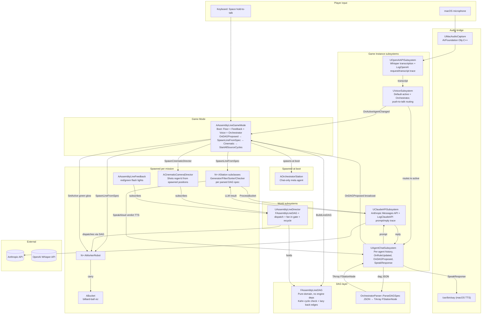
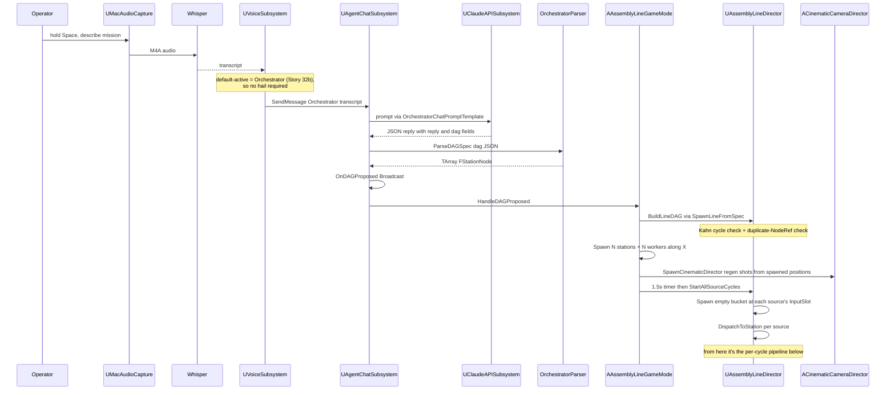
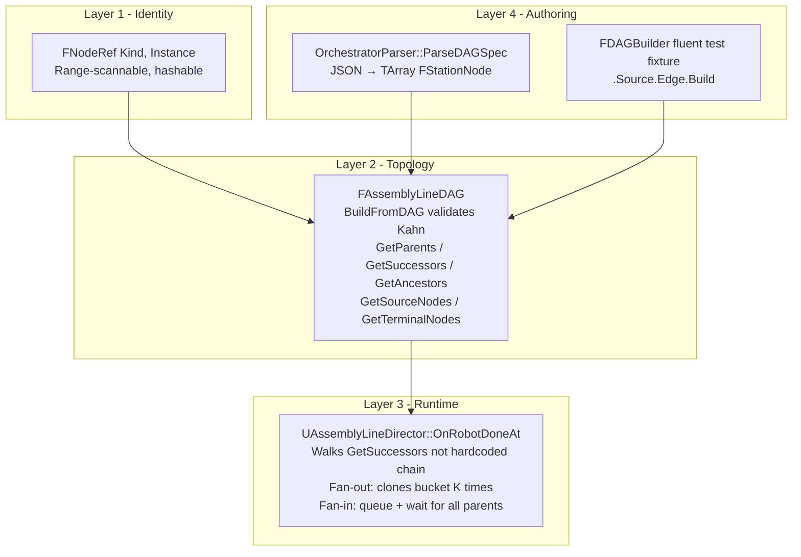
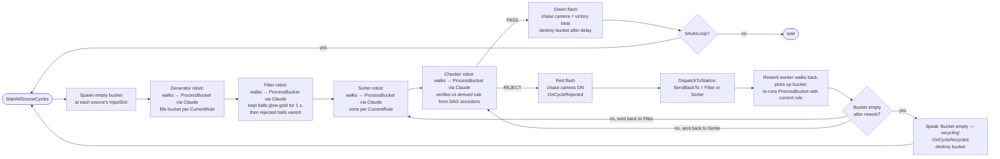
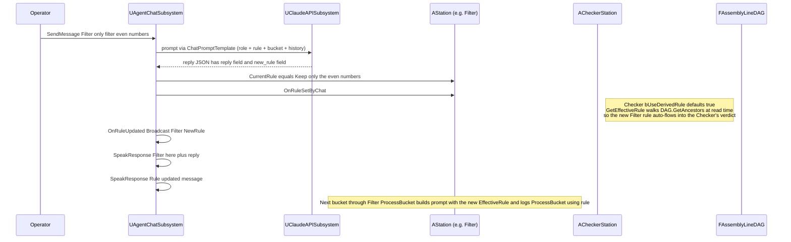
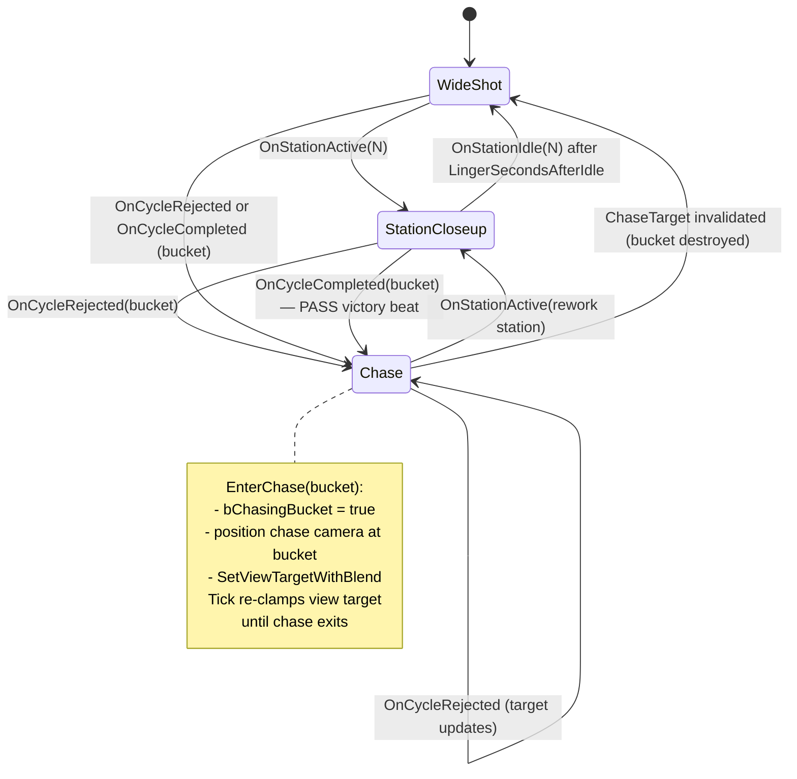

# AssemblyLineSimul

An Unreal Engine 5.7 demo where AI agents — driven by **Anthropic Claude** —
collaborate on an assembly line. Press Play and only the **Orchestrator**
agent stands at the dock; describe a mission out loud
(*"generate numbers, filter the primes, sort them, then check"*), and the
Orchestrator returns a JSON DAG spec that materializes the line. Stations
spawn, workers spawn, the cinematic camera reframes itself around the
spawned topology, and the first cycle starts. Every station's behavior is
driven by a plain-English `CurrentRule` you can change on the fly via
**voice push-to-talk (OpenAI Whisper)**. The Checker auto-derives its
verdict rule from upstream agents by walking the DAG, calls out failures
by name, and the cinematic camera chases the rejected bucket back through
the pipeline so the audience can watch the agents recover.

The project doubles as a worked example of:

- **LLM-driven game behavior** — Claude Sonnet for reasoning, Whisper for
  STT, macOS `say` for TTS
- **A pure-domain DAG executor** for the assembly-line topology (Sui-inspired:
  edges-on-child, lazy back-edge cache, iterative BFS, Kahn's-algorithm
  cycle check at build time, fan-in wait-and-collect gate)
- **Mission-driven spawn**: an Orchestrator agent emits a JSON DAG spec
  from a spoken mission; the runtime parses it, validates it, and builds
  the line at runtime — no hardcoded station chain
- **A cinematic camera that reacts to gameplay events** (station closeups,
  reject-chase, victory holds — all regenerated from spawned positions)
- **Strict TDD-style automation specs** for non-trivial UE features
  (126 specs across 16 spec files, plus a real-Claude FunctionalTest)
- **Mid-flight rule changes** propagating through a stateful pipeline
  without breaking the cycle

## Table of contents

1. [What you see when you press Play](#what-you-see-when-you-press-play)
2. [Quick start](#quick-start)
3. [Architecture](#architecture)
   - [System overview](#system-overview)
   - [Mission-driven spawn flow](#mission-driven-spawn-flow)
   - [DAG executor](#dag-executor)
   - [Per-cycle pipeline (typical 4-station mission)](#per-cycle-pipeline-typical-4-station-mission)
   - [Voice loop](#voice-loop)
   - [Chat / rule-update flow](#chat--rule-update-flow)
   - [Cinematic camera state machine](#cinematic-camera-state-machine)
4. [User stories](#user-stories)
5. [Testing](#testing)
6. [Project layout](#project-layout)
7. [External services & keys](#external-services--keys)
8. [Packaging a standalone build](#packaging-a-standalone-build)
9. [Known limitations / future work](#known-limitations--future-work)

---

## What you see when you press Play

A single humanoid worker robot — the **Orchestrator** — stands alone on a
metallic industrial floor. No assembly line yet; no Generator, Filter,
Sorter, or Checker. The Orchestrator's job is to listen.

Hold **Space** and describe a mission: *"Generate ten numbers between one
and a hundred, filter the primes, sort them ascending, then check the
result."* Release Space; Whisper transcribes; Claude (as the Orchestrator)
returns a JSON DAG spec; the runtime parses it, validates the topology,
and **spawns the line into the world**: one station per node, one worker
per station, laid out along X in DAG order. The cinematic camera
regenerates its shot list from the freshly spawned positions, holds a
wide overview for ~1.5 s, then the Director kicks the first cycle on
every source node in the DAG.

From here on it's the demo you'd expect from a 4-station Generator →
Filter → Sorter → Checker line:

1. The **Generator** robot's bucket fills with a fresh batch of
   integers per its `CurrentRule`. The bucket renders as a glowing-gold
   wireframe crate with billiard-style numbered spheres inside.
2. The **Filter** worker carries the bucket to its dock. Claude returns
   the kept subset; the SELECTED balls glow emissive gold for one second
   while the rejected balls stay with their normal painted-number
   material — the audience sees exactly which were chosen — then the
   rejected balls vanish and only the survivors continue.
3. The **Sorter** reorders the kept items (default: strictly ascending).
4. The **Checker** verifies the bucket against its **derived** rule.
   `bUseDerivedRule` defaults to true, so at read time `GetEffectiveRule`
   walks the DAG ancestors of the Checker node and composes their
   current rules into one: *"Generator did X, Filter did Y, Sorter did
   Z — does this bucket fit?"*. Mid-flight rule changes upstream
   automatically reach the Checker's verdict without a recompile.
   - **PASS** → green light flashes, the camera holds a victory close-up
     on the accepted bucket, the Checker says **"Pass."** — a single
     word, since the green flash already conveys success — then the
     next cycle spawns.
   - **REJECT** → red light flashes, the Checker complains aloud naming
     every offending value and the responsible station, the rework
     worker carries the bucket back, and the **camera chases the
     bucket** until it docks at the rework station.

At any point you can press and hold **Space** to talk to a specific
agent: *"Hey Filter, do you read me?"* → the Filter worker glows green,
the Filter agent replies aloud *"Filter here, reading you loud and
clear. Go ahead."* → next push-to-talk gets routed to Filter as a
command (e.g. *"Only filter the odd numbers"*). Filter acknowledges via
TTS and every subsequent bucket flows through the new rule. The
Checker's derived rule auto-updates because the DAG walk re-reads
upstream `CurrentRule`s at every verdict.

Voice is the only input channel — no chat HUD. Pressing Space also
**silences** any in-flight agent voice (Story 26) — if the Checker is
mid-verdict and you start speaking, the Checker cuts off so you're not
fighting it for the audio channel.

## Quick start

**Requirements:** macOS, UE 5.7, an Anthropic API key, an OpenAI API key
(for Whisper). Both keys are pay-as-you-go API credits — *not* the
ChatGPT Plus / Claude Max subscriptions, which don't include API access.

```bash
# 1. Clone
git clone git@github.com:eyupgurel/AssemblyLineSimul.git
cd AssemblyLineSimul

# 2. Drop your API keys (gitignored, auto-staged into packaged builds)
echo 'sk-ant-...' > Content/Secrets/AnthropicAPIKey.txt
echo 'sk-...'     > Content/Secrets/OpenAIAPIKey.txt

# 3. Build
"/Users/Shared/Epic Games/UE_5.7/Engine/Build/BatchFiles/Mac/Build.sh" \
    AssemblyLineSimulEditor Mac Development \
    -Project="$PWD/AssemblyLineSimul.uproject"

# 4. Open in editor
open AssemblyLineSimul.uproject
```

In the editor, hit **Play in Editor** (PIE). First Space-press triggers
a macOS microphone permission prompt — click **Allow**.

## Architecture

### System overview



### Mission-driven spawn flow

How a single spoken mission becomes a running assembly line. This is the
Story 32a + 32b path; everything below the parser is the Story 31 DAG
executor.



### DAG executor

The Story 31 work replaced the hardcoded Generator → Filter → Sorter →
Checker chain with a pure-domain DAG layer. Inspired by Sui's
Mysticeti / Bullshark consensus: edges-on-child only (parents don't
know their children), lazy back-edge cache for `GetSuccessors`,
iterative BFS for ancestor walks (no recursion), and Kahn's algorithm
to reject cycles at build time. See [`Docs/DAG_Architecture.md`](Docs/DAG_Architecture.md)
for the full design.



Cycles are validated at `BuildFromDAG` time (Kahn's algorithm); a
cyclic spec returns `false` and leaves the DAG empty so callers can
abort cleanly. Multi-input fan-in nodes use a wait-and-collect gate:
`WaitingFor[Child]` tracks parents not yet arrived for the current
cycle, `InboundBuckets[Child]` queues the buckets, and once the wait
set drains the merge fires with `TArray<ABucket*>` of all inputs. The
agent's `ProcessBucket` decides what merging means (vote, diff,
union — story 31b made the signature multi-input).

### Per-cycle pipeline (typical 4-station mission)

This is what the cycle looks like for the typical mission *"generate,
filter, sort, check"* — a linear 4-node DAG. Fan-out / fan-in
topologies follow the same dispatch but with cloning + the wait gate.



Dispatch between stations is no longer a hardcoded `EStationType`
ladder — `OnRobotDoneAt` consults `DAG.GetSuccessors` for every node.
A single successor forwards the bucket as-is; K > 1 successors
trigger fan-out (the bucket is cloned K times via
`ABucket::CloneIntoWorld`); a successor with K > 1 parents triggers
the fan-in wait gate.

### Voice loop


### Chat / rule-update flow



### Cinematic camera state machine



Note: the shot list is **regenerated from spawned-station positions**
when the line materializes (Story 32b). One wide-overview shot at the
spawned line's centroid + one closeup per spawned station. The
hardcoded `StationCount = 4` layout is gone.

## User stories

Stories 1–13 were implemented before the formal `Stories/` folder
existed; their full intent lives in commit messages
(`git log --oneline | tail -30`). Stories 14+ each have a markdown
spec under `Stories/`.

### Phase 1 — Skeleton (stories 1–2)

- **Story 1** ([`155e28b`](https://github.com/eyupgurel/AssemblyLineSimul/commit/155e28b)) — Initial scaffold: 4 stations, 4 workers, async ProcessBucket, basic FSM, the Checker calls Claude for QA, headless `FullCycleFunctionalTest` proves an end-to-end cycle reaches accept.
- **Story 2** ([`0d06f33`](https://github.com/eyupgurel/AssemblyLineSimul/commit/0d06f33)) — Worker FSM stranding fix: sync stations were getting an `Idle` overwrite on completion; added a "stay in current state if completion already advanced us" guard plus a visible LLM "thinking" beat for the Checker.

### Phase 2 — Visual basics (stories 3–5)

- **Story 3** ([`1f7c42e`](https://github.com/eyupgurel/AssemblyLineSimul/commit/1f7c42e)) — Workers can adopt a designer-assigned skeletal mesh; per-station tint via dynamic material instances on the body.
- **Story 4** ([`5521db6`](https://github.com/eyupgurel/AssemblyLineSimul/commit/5521db6)) — Composite mech body from 6 engine `BasicShapes` primitives (torso, dome, eye, two arms, antenna) — looks like a robot until a real mesh is dropped in.
- **Story 5** ([`861ede4`](https://github.com/eyupgurel/AssemblyLineSimul/commit/861ede4)) — Replaced the floating TextRender talk label with a per-station UMG `UStationTalkWidget` hosted by a world-space `UWidgetComponent` (deleted in Story 23).

### Phase 3 — Cinematic & feedback (stories 6–9)

- **Story 6** ([`c3b2f15`](https://github.com/eyupgurel/AssemblyLineSimul/commit/c3b2f15)) — `ACinematicCameraDirector` with declarative `Shots[]`, auto-advance, reactive Checker jump.
- **Story 7** ([`20c7e23`](https://github.com/eyupgurel/AssemblyLineSimul/commit/20c7e23)) — Bumped the FullCycle test `TimeLimit` to fit a real Claude round-trip, suppressed expected `LogClaudeAPI` warnings.
- **Story 8** ([`1f75da4`](https://github.com/eyupgurel/AssemblyLineSimul/commit/1f75da4)) — Designers can swap `UStationTalkWidget` for a Blueprint subclass via `TalkWidgetClass`.
- **Story 9** ([`68b1aad`](https://github.com/eyupgurel/AssemblyLineSimul/commit/68b1aad)) — `AAssemblyLineFeedback` flashes transient green/red point lights on Checker accept / reject.

### Phase 4 — Bucket visualisation (stories 10–11)

- **Story 10** ([`abce2ad`](https://github.com/eyupgurel/AssemblyLineSimul/commit/abce2ad)) — Bucket renders contents as numbered spheres inside a 12-edge wireframe crate.
- **Story 11** ([`4fe0d46`](https://github.com/eyupgurel/AssemblyLineSimul/commit/4fe0d46)) — Spheres become billiard-style: per-number color, runtime canvas-rendered numbers painted onto the ball via a dynamic material instance.

### Phase 5 — Cinematic polish (story 12)

- **Story 12** ([`b5fb752`](https://github.com/eyupgurel/AssemblyLineSimul/commit/b5fb752) + [`5c5c3a3`](https://github.com/eyupgurel/AssemblyLineSimul/commit/5c5c3a3) + [`ce1796a`](https://github.com/eyupgurel/AssemblyLineSimul/commit/ce1796a)) — Reactive station closeups with wide-shot resume, slowed pacing for audience comprehension, workbench mesh on each station so the bucket has somewhere to sit.

### Phase 6 — LLM-driven everything (story 13)

- **Story 13** ([`871b43c`](https://github.com/eyupgurel/AssemblyLineSimul/commit/871b43c) + [`37d2fe5`](https://github.com/eyupgurel/AssemblyLineSimul/commit/37d2fe5)) — Every station's `ProcessBucket` becomes async LLM-driven. Each station has a plain-English `CurrentRule` that the chat subsystem updates when a user instructs the agent. The Checker auto-derives its rule from upstream agents (originally a hardcoded type lookup; Story 31a generalized this to walk the DAG ancestors).

### Phase 7 — Voice & output channels (stories 14–15)

- **[Story 14](Stories/Story_14_Voice_Driven_Agent_Dialogue.md)** — Push-to-talk → Whisper → hail parser → sticky-context routing. Hold **Space**, say *"Hey Filter, do you read me?"* → Filter glows + speaks the affirmation → next push-to-talk routes directly to Filter as a chat command. Whisper pinned to `language=en`; reply prefix `"<Agent> here. ..."` so every command-reply is acknowledged.
- **[Story 15](Stories/Story_15_Audible_Checker_Verdicts.md)** — `AStation::SpeakAloud` does panel + macOS `say` together; Checker uses it for both PASS and the verbose REJECT complaint, so failures aren't silent.

### Phase 8 — Failure handling (stories 16–17)

- **[Story 16](Stories/Story_16_Camera_Follows_Rejected_Bucket.md)** — Cinematic chase camera. On REJECT the camera follows the bucket back to the rework station; on PASS the camera holds a "victory beat" close-up on the accepted bucket until it vanishes. Chase ends when the rework station's worker enters Working (or the bucket is destroyed).
- **[Story 17](Stories/Story_17_Robust_Rework_Flow.md)** — Mid-flight rule changes don't cancel the in-flight bucket; the failure case (bucket leaves Filter on old rule, Checker catches it, bounces back, Filter re-runs with new rule) is the demo. Empty bucket after rework triggers a visible recycle (`OnCycleRecycled`) and a fresh Generator cycle.

### Phase 9 — Worker / scene polish (stories 18–20)

- **[Story 18](Stories/Story_18_Worker_Visual_Polish.md)** — Workers swap their primitive mech body for the UE5 Manny mannequin (`AnimSequence` idle / walk swap, 1.5× actor scale).
- **[Story 19](Stories/Story_19_Active_Agent_Worker_Glow.md)** — Active-speaker green point light moves from the station to the worker — the talking agent's robot literally glows green next to its dock.
- **[Story 20](Stories/Story_20_Industrial_Floor.md)** — Stylized metallic-floor asset pack tiled 60×60 under the line.

### Phase 10 — Visual cleanup pivot (stories 21–25)

- **Story 21** — *Abandoned.* Imported a Fab "Free Fantasy Work Table" prop to replace the placeholder station bodies; the FBX's intrinsic pivot offset combined with the `BilliardBallMaterial` wiring made the placement and bucket-dock chain too fragile. Reverted.
- **[Story 22](Stories/Story_22_Cleanup_After_Gold_Bucket.md)** — Cleanup pass after the gold-bucket pivot: dropped orphaned `ABucket::GlassMaterial`, removed dead cube-mesh assignments on hidden `MeshComponent`/`WorkTable` in `AStation`.
- **[Story 23](Stories/Story_23_Strip_InWorld_Text.md)** — Stripped every in-world text label (station name labels, in-world UMG talk panels, worker state labels, per-ball number labels). The whole `UStationTalkWidget` class + WBP asset deleted. TTS audio preserved — only the visual panel-write paths went.
- **[Story 24](Stories/Story_24_Filter_Selected_Glow.md)** — *Superseded by Story 25.* First attempt at gold-glow on filter survivors painted every post-filter ball gold, but by then the rejected balls had already been destroyed — no contrast.
- **[Story 25](Stories/Story_25_Filter_Selection_Preview.md)** — Filter selection preview: when Claude returns the kept subset, the SELECTED balls glow emissive gold for one second while the REJECTED balls remain visible — audience sees the contrast — then the rejected balls vanish and only survivors continue. New static helper `AFilterStation::FindKeptIndices` maps each kept value to its first-occurrence index.

### Phase 11 — Operator-experience polish (stories 26–28)

- **[Story 26](Stories/Story_26_Terse_Pass_And_Silence_Agents.md)** — Two pacing fixes: (1) the Checker's PASS verdict drops the LLM-generated reason and just says **"Pass."** — the visible green flash already conveys success. REJECT keeps the verbose complaint. (2) Pushing **Space** to talk now silences any in-flight agent voice — `UAgentChatSubsystem::StopSpeaking` terminates every running `/usr/bin/say` subprocess so the operator isn't fighting an agent for the audio channel.
- **[Story 27](Stories/Story_27_Externalize_Agent_Prompts.md)** — Every Claude-bound prompt template moves out of `.cpp` string literals into editable `.md` files under `Content/Agents/` (per-agent + a shared `ChatPrompt.md`). New `AgentPromptLibrary` namespace loads, caches, and substitutes `{{name}}` placeholders. Refactor only — prompts go out byte-identical.
- **[Story 28](Stories/Story_28_Remove_Tab_Chat_Widget.md)** — Strip the Tab-toggled `UAgentChatWidget` entirely (class files deleted, GameMode plumbing removed, Tab keybinding gone). Voice push-to-talk is now the only input channel. `UAgentChatSubsystem` itself stays (the voice path uses it).

### Phase 12 — Observability (stories 29–30)

- **[Story 29](Stories/Story_29_Log_Claude_Traffic.md)** — Every Claude prompt + response is logged under `LogClaudeAPI` at `Display` level. Prompts are sanitized (rule + bucket contents preserved; chat history truncated past N turns). Lets you `grep` a single PIE session's log to reconstruct exactly which prompt produced which Claude reply for any station — no more guessing whether a weird verdict was a stale rule or a model misfire.
- **[Story 30](Stories/Story_30_Log_Whisper_Traffic.md)** — Mirror of 29 for Whisper: every transcription request (audio bytes elided; metadata kept) + the returned transcript logged under `LogOpenAI`. Together with Story 29, the entire `mic → transcript → Claude prompt → Claude reply → station behavior` chain is reproducible from logs.

### Phase 13 — DAG executor (stories 31a–31e)

The hardcoded `EStationType` ladder in `OnRobotDoneAt` becomes a
pure-domain DAG layer, validated at build time, traversed iteratively,
ready to accept fan-out / fan-in topologies from a runtime spec.
Inspired by Sui's Mysticeti / Bullshark consensus —
see [`Docs/DAG_Architecture.md`](Docs/DAG_Architecture.md).

- **[Story 31a](Stories/Story_31a_DAG_Foundation.md)** — `FNodeRef`, `FStationNode`, `FAssemblyLineDAG`. `BuildFromDAG` runs Kahn's cycle check; lazy back-edge cache for `GetSuccessors`; iterative BFS for `GetAncestors`. Director holds the DAG by value; `OnRobotDoneAt` consults `GetSuccessors` instead of a hardcoded chain. `ACheckerStation::GetEffectiveRule` walks `GetAncestors` to compose its derived rule. Linear 4-station chain still produces byte-identical behavior.
- **[Story 31b](Stories/Story_31b_Multi_Input_Signature.md)** — `AStation::ProcessBucket` signature changes from `(ABucket*, OnComplete)` to `(const TArray<ABucket*>& Inputs, OnComplete)`. All 4 station subclasses updated to read `Inputs[0]`. Sets up the multi-input fan-in story.
- **[Story 31c](Stories/Story_31c_Fan_Out.md)** — When a node has K > 1 successors, `OnRobotDoneAt` clones the bucket K times via `ABucket::CloneIntoWorld` (one per branch) and dispatches each clone to its target. The original is destroyed.
- **[Story 31d](Stories/Story_31d_Fan_In.md)** — When a child has K > 1 parents, dispatch is queued: `WaitingFor[Child]` tracks parents not yet arrived; `InboundBuckets[Child]` queues the buckets. Once the wait set drains, the merge fires with `TArray<ABucket*>` of all inputs. After the agent's `ProcessBucket` returns, `Inputs[0]` survives and continues the chain; `Inputs[1..N-1]` are destroyed. Wait state resets per cycle.
- **[Story 31e](Stories/Story_31e_DAG_Test_Builder.md)** — `FDAGBuilder` fluent test fixture: `.Source(ref).Edge(from, to).Build()` returns `TArray<FStationNode>` ready for `BuildFromDAG`. Replaces hand-rolled `FStationNode{...}` literals across 6 spec sites; tests read in DAG terms instead of array literals.

### Phase 14 — Orchestrator (stories 32a–32b)

The user-visible payoff for the DAG layer: an Orchestrator agent
takes a spoken mission and returns a JSON DAG spec; the runtime
materializes the line at boot.

- **[Story 32a](Stories/Story_32a_Orchestrator_Agent.md)** — `EStationType::Orchestrator` enum value, `Content/Agents/Orchestrator.md` prompt, `OrchestratorChatPromptTemplate` (asks for `{"reply", "dag"}` instead of `{"reply", "new_rule"}`), `AOrchestratorStation` class, and `OrchestratorParser::ParseDAGSpec` (JSON → `TArray<FStationNode>`). Production behavior unchanged — pure additive prep work.
- **[Story 32b](Stories/Story_32b_Mission_Driven_Boot.md)** — The headline. `SpawnAssemblyLine` removed; replaced by `SpawnOrchestrator` (boot — one chat-only station) + `SpawnLineFromSpec` (mission — N stations + workers + DAG built). `AgentChatSubsystem::OnDAGProposed` fires when the Orchestrator's reply parses; `BeginPlay` subscribes and runs spawn → cinematic regen → `StartAllSourceCycles`. `VoiceSubsystem` defaults active-agent to Orchestrator so the operator's first push-to-talk lands without a hail. `SpawnCinematicDirector` regenerates `Shots` from spawned-station positions instead of a hardcoded `StationCount = 4` layout. v1 enforces single-instance-per-kind (multi-instance is deferred — see Known limitations).

## Testing

The project uses **UE Automation Specs** (BDD-style `Describe` / `It`)
plus one **FunctionalTest** actor for end-to-end coverage.

**Run the full suite headless:**

```bash
"/Users/Shared/Epic Games/UE_5.7/Engine/Binaries/Mac/UnrealEditor-Cmd" \
    "$PWD/AssemblyLineSimul.uproject" \
    -ExecCmds="Automation RunTests AssemblyLineSimul; Quit" \
    -unattended -nullrhi -log -NoSplash -ABSLOG=/tmp/auto.log
```

Then `grep -c 'Result={Success}' /tmp/auto.log` for a pass count and
`grep -c 'Result={Fail}' /tmp/auto.log` for a fail count.

**Current coverage: 126 specs across 16 spec files plus the
FunctionalTest** (every spec passes against real Anthropic + OpenAI
APIs when keys are configured; specs that don't need network use
synthesised LLM responses fed through public test seams).

| Spec file | What it locks down |
| --- | --- |
| `AgentChatSubsystemSpec` | Per-agent history isolation, prompt construction, `SpeakResponse` test hook (`LastSpokenForTesting`), `OnRuleUpdated` broadcast on chat-driven rule change, `StopSpeaking` (Story 26) empties active-say-handle store, **`OnDAGProposed` (Story 32b) — broadcasts on Orchestrator dag-spec replies, silent on `dag: null` and on non-Orchestrator agents**. |
| `AgentPromptLibrarySpec` | Story 27 prompt loader: `LoadAgentSection` returns the right `.md` section, missing sections log a warning, `FormatPrompt` resolves `{{name}}` placeholders and surfaces unresolved ones. |
| `AssemblyLineDAGSpec` | Story 31a DAG: `BuildFromDAG` rejects cycles via Kahn's algorithm (returns false + leaves DAG empty), `GetParents` / `GetSuccessors` / `GetAncestors` produce the right edges in deterministic order, lazy back-edge cache builds on first `GetSuccessors` call, source/terminal node detection. |
| `AssemblyLineDirectorSpec` | Worker phase events re-broadcast as `OnStationActive`, empty-bucket recycle path, **fan-out (Story 31c) clones bucket K times and destroys source on K > 1 successors**, **fan-in (Story 31d) wait-and-collect gate fires merge once both parents arrive and re-arms per cycle**, **`StartAllSourceCycles` (Story 32b) dispatches one bucket per source node**. |
| `AssemblyLineFeedbackSpec` | Accept/reject light spawning at the bucket location. |
| `AssemblyLineGameModeSpec` | **`SpawnOrchestrator` (Story 32b) spawns exactly one `AOrchestratorStation` and zero workers + registers with the Director**, **`SpawnLineFromSpec` spawns one station + worker per node, applies per-node rules, picks the right subclass per `Kind`, rejects duplicate-kind specs (AC32b.9), leaves the world untouched on cycles**, **`SpawnCinematicDirector` regenerates `Shots` from the spawned line — 4 stations → 5 shots, 2 stations → 3 shots, proves the count is data-driven not hardcoded**, propagates `WorkerRobotMeshAsset` / `BucketClass`, `SpawnFloor` (Story 20) tiles correctly. |
| `BucketSpec` | Crate construction, `RefreshContents` add/remove, billiard MID wiring, `HighlightBallsAtIndices` (Story 25), **`CloneIntoWorld` (Story 31c) — distinct ABucket actor with copied Contents and propagated `BilliardBallMaterial`**. |
| `CinematicCameraDirectorSpec` | Shot looping/holding, reactive station jumps, return-to-resume on idle, chase enters/exits on cycle events, target updates on second rejection, PASS chase + null-bucket fallback. |
| `DAGBuilderSpec` | Story 31e fluent fixture: `Source` adds a parent-less node, `Edge(from, to)` adds an edge with `AddUnique` parent dedup, `Build()` returns the right `TArray<FStationNode>` ready for `BuildFromDAG`. |
| `OpenAIAPISubsystemSpec` | Whisper multipart body shape: `language=en` pinned, `model=whisper-1`, file part with filename + MIME, raw audio bytes embedded verbatim. |
| `OrchestratorParserSpec` | Story 32a: empty `{"nodes":[]}` parses to empty `TArray`, linear / fan-out / fan-in JSON specs parse to the right `TArray<FStationNode>`, malformed JSON returns false + Error log, unknown station type returns false, undeclared parent ID returns false. |
| `StationSpec` | `SpeakAloud` routes through chat subsystem TTS, Checker PASS speaks just "Pass." (Story 26), REJECT keeps verbose complaint, LLM-unreachable PASS fallback also speaks "Pass." |
| `StationSubclassesSpec` | `AFilterStation::FindKeptIndices` (Story 25): input/kept index mapping with first-occurrence claiming for duplicates; empty edge cases. |
| `VoiceHailParserSpec` | Canonical hail pattern, case insensitivity, alternative confirmations, rejection of non-hails, fuzzy match (Levenshtein ≤ 2) for Whisper letter swaps. |
| `VoiceSubsystemSpec` | **Default-active = Orchestrator at construction (Story 32b)**, hail switches active agent, sticky-context command routing, second hail switches agent. |
| `WorkerRobotSpec` | FSM phase events, body-mesh assignment, tint MIDs, sync vs deferred completion. |
| `FullCycleFunctionalTest` | One full Generator → Filter → Sorter → Checker cycle reaches accept. Calls real Claude. |

The TDD discipline is **strict RED → GREEN → Refactor**:
1. Write a story doc under `Stories/Story_NN_…md` (or update an existing one).
2. Add failing spec(s) — confirm RED via headless sweep.
3. Implement the minimum code to flip them GREEN.
4. Run the full sweep — must stay all-green.
5. Commit with a message that names the story and lists the new spec count.

## Project layout

```
AssemblyLineSimul/
├── README.md                 ← you are here
├── AssemblyLineSimul.uproject
├── Build/
│   └── Mac/
│       ├── Resources/        ← engine-generated entitlements + plist template
│       └── Scripts/
│           └── fix_voice_in_packaged_app.sh  ← post-stage Info.plist + codesign fix
├── Config/
│   ├── DefaultEngine.ini     ← GlobalDefaultGameMode = BP_AssemblyLineGameMode +
│   │                           ExtraPlistData NSMicrophoneUsageDescription
│   └── DefaultGame.ini       ← +DirectoriesToAlwaysStageAsNonUFS=(Path="Secrets")
├── Docs/
│   ├── Agent_Instructions.md ← thin pointer to Content/Agents/ .md prompts
│   └── DAG_Architecture.md   ← Layer 1-5 design + 5 locked decisions
├── Content/
│   ├── BP_AssemblyLineGameMode.uasset
│   ├── BP_BilliardBucket.uasset
│   ├── L_AssemblyDemo.umap
│   ├── M_BilliardBall.uasset
│   ├── Agents/               ← Story 27: per-agent prompts (loaded by AgentPromptLibrary)
│   │   ├── ChatPrompt.md     ← shared chat-prompt templates (default + OrchestratorChatPromptTemplate)
│   │   ├── Generator.md
│   │   ├── Filter.md
│   │   ├── Sorter.md
│   │   ├── Checker.md
│   │   └── Orchestrator.md   ← Story 32a: chat-only meta agent
│   ├── Metallic_Floor/       ← Stylized Metallic Floor asset pack (Story 20)
│   └── Secrets/              ← gitignored API keys; auto-staged into packaged builds
│       ├── AnthropicAPIKey.txt
│       └── OpenAIAPIKey.txt
├── Source/AssemblyLineSimul/
│   ├── AssemblyLineGameMode.{h,cpp}    ← BeginPlay: Floor + Feedback + Voice + Orchestrator
│   │                                     OnDAGProposed handler → SpawnLineFromSpec → Cinematic
│   │                                     → StartAllSourceCycles
│   ├── AssemblyLineDirector.{h,cpp}    ← Holds FAssemblyLineDAG; OnRobotDoneAt walks DAG
│   │                                     successors; fan-in wait gate; recycle
│   ├── AssemblyLineTypes.h             ← EStationType (incl. Orchestrator), FStationProcessResult,
│   │                                     FAgentChatMessage
│   │
│   ├── Station.{h,cpp}                 ← base station: ActiveLight, SpeakAloud (TTS-only),
│   │                                     ProcessBucket(TArray<ABucket*>, OnComplete)
│   ├── StationSubclasses.{h,cpp}       ← Generator, Filter, Sorter, Checker, Orchestrator
│   │                                     Filter::FindKeptIndices for selection preview
│   │                                     Checker::GetEffectiveRule walks DAG ancestors
│   ├── WorkerRobot.{h,cpp}             ← FSM, UE5 Manny mannequin, green ActiveLight
│   ├── Bucket.{h,cpp}                  ← wireframe crate + billiard balls
│   │                                     CloneIntoWorld for Story 31c fan-out
│   │                                     HighlightBallsAtIndices for Filter selection
│   │
│   ├── DAG/                            ← Story 31 — pure-domain DAG layer
│   │   ├── AssemblyLineDAG.{h,cpp}     ← FNodeRef, FStationNode, FAssemblyLineDAG
│   │   ├── DAGBuilder.h                ← Story 31e fluent test fixture
│   │   └── OrchestratorParser.{h,cpp}  ← Story 32a JSON spec parser
│   │
│   ├── ClaudeAPISubsystem.{h,cpp}      ← Anthropic /v1/messages POST + LogClaudeAPI trace
│   ├── OpenAIAPISubsystem.{h,cpp}      ← Whisper /v1/audio/transcriptions + LogOpenAI trace
│   ├── AgentChatSubsystem.{h,cpp}      ← per-agent chat, OnRuleUpdated, OnDAGProposed,
│   │                                     SpeakResponse (TTS), StopSpeaking
│   ├── AgentPromptLibrary.{h,cpp}      ← Story 27 — loads .md prompts, FormatPrompt placeholder fill
│   ├── VoiceSubsystem.{h,cpp}          ← active-agent state (default = Orchestrator), routing
│   ├── VoiceHailParser.{h,cpp}         ← "hey <agent> do you read me" matcher (Levenshtein)
│   ├── MacAudioCapture.{h,mm}          ← AVAudioRecorder Obj-C++ bridge (Mac-only)
│   │
│   ├── CinematicCameraDirector.{h,cpp} ← shots (regen'd from spawned positions in Story 32b),
│   │                                     reactive jumps, chase camera
│   ├── AssemblyLineFeedback.{h,cpp}    ← red/green flash lights on Checker verdict
│   ├── JsonHelpers.h                   ← shared ExtractJsonObject for chatty LLM replies
│   │
│   └── Tests/                          ← all *Spec.cpp + the FunctionalTest actor
└── Stories/                            ← markdown specs for stories 14-32b (21 abandoned)
```

## External services & keys

| Service | Endpoint | Purpose | Where the key lives |
| --- | --- | --- | --- |
| **Anthropic Messages** | `POST /v1/messages` | Powers every station's `ProcessBucket` (Generator/Filter/Sorter/Checker reasoning + Orchestrator DAG-spec generation) and the chat subsystem (per-agent dialogue + rule updates). Default model `claude-sonnet-4-6`. | `Content/Secrets/AnthropicAPIKey.txt` (preferred — auto-staged into packaged builds) or `Saved/AnthropicAPIKey.txt`. |
| **OpenAI Whisper** | `POST /v1/audio/transcriptions` | Push-to-talk speech → text. Multipart upload of M4A/AAC, `model=whisper-1`, `language=en`. | `Content/Secrets/OpenAIAPIKey.txt` or `Saved/OpenAIAPIKey.txt`. |
| **macOS `say`** | local fork/exec | Text → speech for every TTS line (chat replies, hail handshake, Checker verdicts, rule-updated confirmations). | n/a — bundled with macOS. |

`UClaudeAPISubsystem::LoadAPIKey` and `UOpenAIAPISubsystem::LoadAPIKey`
both check `Saved/` then `Content/Secrets/` and log a `Display`-level
line on success. Story 29 (LogClaudeAPI) and Story 30 (LogOpenAI)
add per-call request/response tracing so you can reconstruct any
single PIE session's full LLM traffic from logs.

## Packaging a standalone build

**Editor:** *Platforms → Mac → Package Project →* pick an output folder.

The package will contain:

- `<App>.app/Contents/UE/AssemblyLineSimul/Content/Secrets/AnthropicAPIKey.txt`
- `<App>.app/Contents/UE/AssemblyLineSimul/Content/Secrets/OpenAIAPIKey.txt`
- `<App>.app/Contents/UE/AssemblyLineSimul/Content/Agents/*.md` (the prompt
  bundle from Story 27 — must ship since `AgentPromptLibrary` reads them
  at runtime)

…all auto-staged via the `+DirectoriesToAlwaysStageAsNonUFS` rule in
`Config/DefaultGame.ini`. **No manual key-copy step needed**, and the
sandboxed Mac container's writable `Saved/` dir is checked first if you
want to override at install time.

Default GameMode is `BP_AssemblyLineGameMode` (set in
`Config/DefaultEngine.ini` so packaged builds use it; without this
fix the package would launch with the empty ThirdPerson template).

### Post-stage fix-up: voice recognition (mandatory after every package)

`Config/DefaultEngine.ini` contains
`+ExtraPlistData=<key>NSMicrophoneUsageDescription</key>...` so the
mic-usage string *should* land in the packaged `Info.plist`
automatically — but UAT silently drops it in UE 5.7 (this worked in
earlier 5.x). Without that key macOS denies mic access without ever
prompting; AVAudioRecorder records 3 s of silence; Whisper transcribes
silence as `"you"`. So every packaged build needs a post-stage patch.

After every `RunUAT BuildCookRun` Mac package (or
*Platforms → Mac → Package Project*), run:

```bash
./Build/Mac/Scripts/fix_voice_in_packaged_app.sh
```

What it does:

1. Adds `NSMicrophoneUsageDescription` to the staged
   `<App>.app/Contents/Info.plist`.
2. Re-signs the bundle ad-hoc (the plist edit invalidates the existing
   code signature; macOS would otherwise refuse to launch it with an
   "invalid Info.plist (plist or signature have been modified)" error).

Optional flag `--reset-permission` also resets macOS's mic permission
cache for the bundle id (`tccutil reset Microphone …`), forcing the OS
to re-prompt on next launch.

Once the script runs, launch the .app and grant mic permission when
prompted (or check **System Settings → Privacy & Security → Microphone**
is toggled ON for the app). Voice should work.

## Known limitations / future work

- **Single instance per kind in the spawn pipeline (Story 32b AC32b.9)**.
  The DAG executor itself supports multi-instance (e.g. two Filters
  branching off one Generator), but `SpawnLineFromSpec` rejects specs
  with duplicate kinds because chat / voice routing currently keys on
  `EStationType`. Lifting this requires refactoring
  `Director::RobotByStation` + `StationByType` to be keyed on `FNodeRef`
  and disambiguating chat/voice routing across instances of one kind.
  Deferred to a follow-up story.
- **One mission per session.** Re-missioning mid-session (operator
  changes their mind, wants a different topology) is not supported.
  Relaunch PIE to retry. Adding this would need the GameMode to tear
  down the existing line + cinematic before applying a new spec.
- **No persistence** of the spawned topology across sessions.
- **Visual spawn animation is instant.** Stations and workers pop in
  the moment `SpawnLineFromSpec` completes. A staged "build animation"
  (one station materializing per beat, walked into place) would sell
  the moment more.
- **macOS only**: `UMacAudioCapture` is the only voice-capture backend;
  voice flow degrades gracefully (silently no-ops) on other platforms.
  A Windows backend would be a small Win32 wrapper around
  `IAudioCaptureClient`.
- **Packaged-build mic permission needs the post-stage script** —
  see [Post-stage fix-up](#post-stage-fix-up-voice-recognition-mandatory-after-every-package).
  Root cause is UAT silently dropping `+ExtraPlistData` in UE 5.7;
  worth re-checking on each engine update to see if the upstream fix
  lands.
- **TTS race**: `SpeakResponse` writes to a single
  `agent_say_buffer.txt` file and forks `say -f`. Concurrent speakers
  (rapid hail + chat reply + Checker verdict) can clobber each other's
  input file in rare cases. Fix: switch to per-call unique filenames
  or pipe text via `osascript`.
- **No rework cap**: the Director will keep dispatching rejected
  buckets back to the rework station as long as the Checker keeps
  rejecting. By design (the demo wants to show the agents trying
  again), but in production you'd want a hard limit + a manual abort
  signal.
- **Filter selection preview only** — Sorter and Checker don't have
  an analogous "what changed?" highlight. The Sorter could flash
  reorder arrows, the Checker could outline rule-violators in red.
