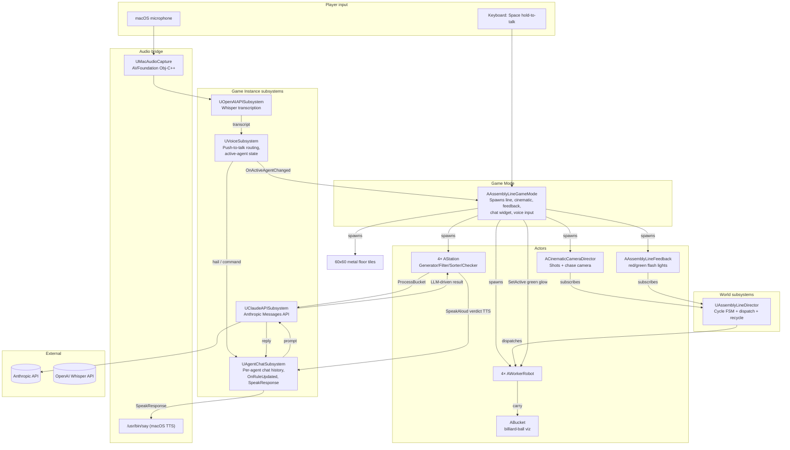
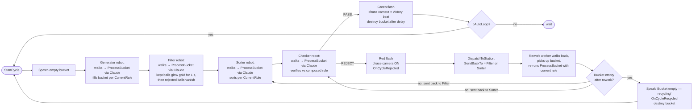
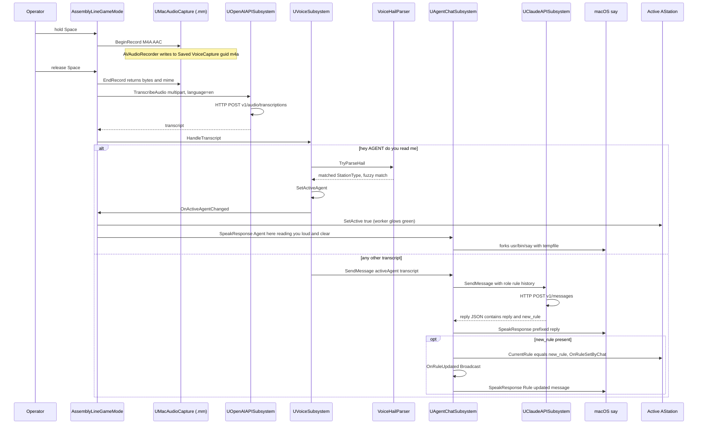
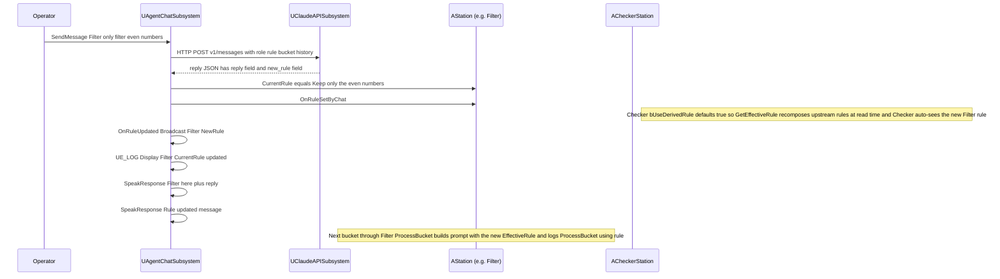
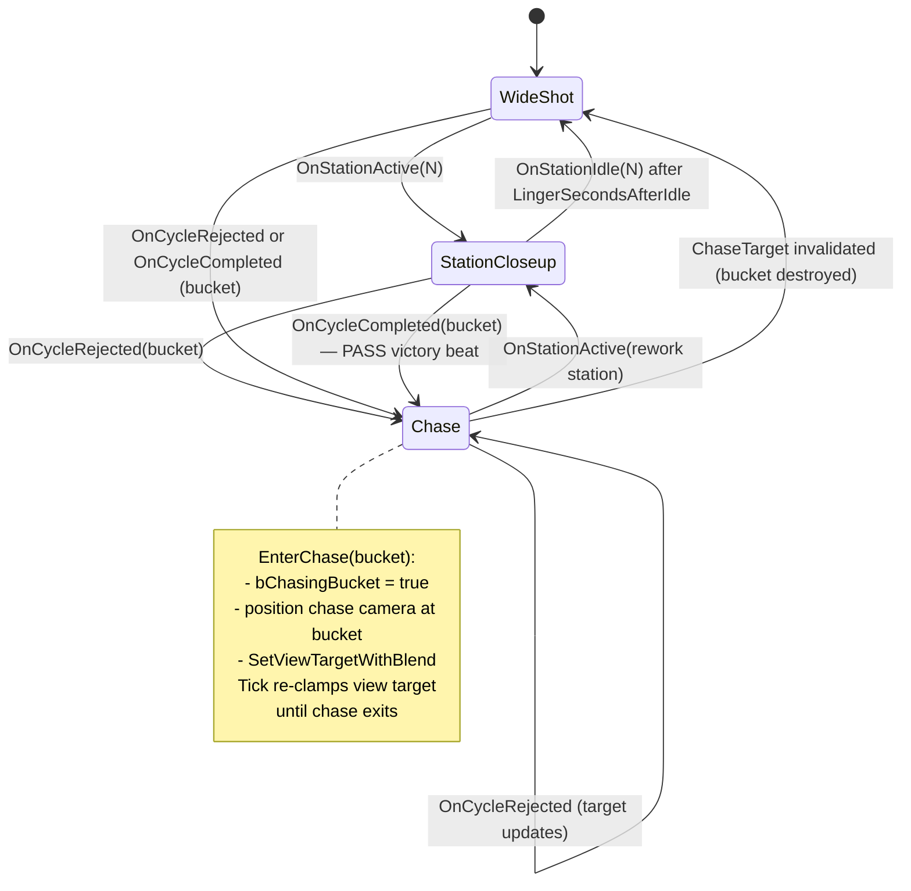

# AssemblyLineSimul

An Unreal Engine 5.7 demo where four AI agents — **Generator**, **Filter**,
**Sorter**, **Checker** — collaborate on a literal assembly line. Every
agent is driven by the **Anthropic Claude API**: the rules they follow
are plain‑English strings the operator can change on the fly via
**voice (OpenAI Whisper push‑to‑talk)** or text chat. The Checker auto‑
derives its rule from the upstream agents, calls out failures by name,
and the cinematic camera chases the rejected bucket back through the
pipeline so the audience can watch the agents recover from a bad cycle
in real time.

The project doubles as a worked example of:

- driving game behavior with LLMs (Claude Sonnet for reasoning, Whisper for STT, macOS `say` for TTS)
- a cinematic camera that reacts to gameplay events
- strict TDD‑style automation specs for non‑trivial UE features
- mid‑flight rule changes propagating through a stateful pipeline without breaking the cycle

## Table of contents

1. [What you see when you press Play](#what-you-see-when-you-press-play)
2. [Quick start](#quick-start)
3. [Architecture](#architecture)
   - [System overview](#system-overview)
   - [Per‑cycle pipeline](#per-cycle-pipeline)
   - [Voice loop](#voice-loop)
   - [Chat / rule‑update flow](#chat--rule-update-flow)
   - [Cinematic camera state machine](#cinematic-camera-state-machine)
4. [User stories](#user-stories)
5. [Testing](#testing)
6. [Project layout](#project-layout)
7. [External services & keys](#external-services--keys)
8. [Packaging a standalone build](#packaging-a-standalone-build)
9. [Known limitations / future work](#known-limitations--future-work)

---

## What you see when you press Play

Four humanoid worker robots (UE5 Manny mannequin with idle / walk
anim swap) stand at four invisible stations along a metallic
industrial floor — the line itself is conveyed entirely visually,
no labels or panels in the world. Buckets glow gold. The agents
talk to you out loud.

Each station's footprint is just an empty dock above the floor.
Buckets float there during processing; nothing else is visible
above the floor at the station except the worker. A green point
light lights up the worker whose agent is the **active voice
speaker** (so when you say *"Hey Filter"*, the Filter worker
literally glows green).

When the cycle starts:

1. The **Generator** robot's bucket fills with a fresh batch of
   integers per the agent's current rule (default: *"Generate 10
   random integers in the range 1 to 100"*). The bucket renders as
   a glowing-gold wireframe crate (12 emissive cylinder edges) with
   billiard-style numbered spheres inside.
2. The **Filter** worker carries the bucket to its dock. Claude
   returns the kept subset; the SELECTED balls glow emissive gold
   for one second while the rejected balls stay with their normal
   painted-number material — the audience sees exactly which were
   chosen — then the rejected balls vanish and only the survivors
   continue.
3. The **Sorter** reorders the kept items (default: *strictly
   ascending*).
4. The **Checker** verifies the bucket against the *composed* rule
   chain ("Generator did X, Filter did Y, Sorter did Z — does this
   bucket fit?").
   - **PASS** → green light flashes, the camera holds a victory
     close-up on the accepted bucket, the Checker says **"Pass."** —
     a single word, no justification, since the green flash already
     conveys success — then the next cycle spawns.
   - **REJECT** → red light flashes, the Checker complains aloud
     naming every offending value and the responsible station, the
     rework worker carries the bucket back, and the **camera chases
     the bucket** until it docks at the rework station.

At any point you can press and hold **Space** to talk to a specific
agent: *"Hey Filter, do you read me?"* → the Filter worker glows
green, the Filter agent replies aloud *"Filter here, reading you
loud and clear. Go ahead."* → next push-to-talk gets routed to
Filter as a command (e.g. *"Only filter the odd numbers"*). Filter
acknowledges via TTS and every subsequent bucket flows through the
new rule. The Checker's derived rule auto-updates too, so it
correctly catches buckets that made it through Filter on the *old*
rule. Voice is the only input channel — there's no chat HUD.

Pressing Space also **silences** any in-flight agent voice (Story
26) — if the Checker is mid-verdict and you start speaking, the
Checker cuts off so you're not fighting it for the audio channel.

## Quick start

**Requirements:** macOS, UE 5.7, an Anthropic API key, an OpenAI API
key (for Whisper). Both keys are pay‑as‑you‑go API credits — *not* the
ChatGPT Plus / Claude Max subscriptions, which don't include API access.

```bash
# 1. Clone
git clone git@github.com:eyupgurel/AssemblyLineSimul.git
cd AssemblyLineSimul

# 2. Drop your API keys (gitignored, auto‑staged into packaged builds)
echo 'sk-ant-...' > Content/Secrets/AnthropicAPIKey.txt
echo 'sk-...'     > Content/Secrets/OpenAIAPIKey.txt

# 3. Build
"/Users/Shared/Epic Games/UE_5.7/Engine/Build/BatchFiles/Mac/Build.sh" \
    AssemblyLineSimulEditor Mac Development \
    -Project="$PWD/AssemblyLineSimul.uproject"

# 4. Open in editor
open AssemblyLineSimul.uproject
```

In the editor, hit **Play in Editor** (PIE). First Space‑press triggers a
macOS microphone permission prompt — click **Allow**.

## Architecture

### System overview



### Per‑cycle pipeline



### Voice loop



### Chat / rule‑update flow



### Cinematic camera state machine



## User stories

Stories 1–13 were implemented before the formal `Stories/` folder
existed; their full intent lives in commit messages
(`git log --oneline | tail -30`). Stories 14–17 each have a markdown
spec under `Stories/`.

### Phase 1 — Skeleton (stories 1–2)

- **Story 1** ([`155e28b`](https://github.com/eyupgurel/AssemblyLineSimul/commit/155e28b)) — Initial scaffold: 4 stations, 4 workers, async ProcessBucket, basic FSM, the Checker calls Claude for QA, headless `FullCycleFunctionalTest` proves an end‑to‑end cycle reaches accept.
- **Story 2** ([`0d06f33`](https://github.com/eyupgurel/AssemblyLineSimul/commit/0d06f33)) — Worker FSM stranding fix: sync stations were getting an `Idle` overwrite on completion; added a "stay in current state if completion already advanced us" guard plus a visible LLM "thinking" beat for the Checker.

### Phase 2 — Visual basics (stories 3–5)

- **Story 3** ([`1f7c42e`](https://github.com/eyupgurel/AssemblyLineSimul/commit/1f7c42e)) — Workers can adopt a designer‑assigned skeletal mesh; per‑station tint via dynamic material instances on the body.
- **Story 4** ([`5521db6`](https://github.com/eyupgurel/AssemblyLineSimul/commit/5521db6)) — Composite mech body from 6 engine `BasicShapes` primitives (torso, dome, eye, two arms, antenna) — looks like a robot until a real mesh is dropped in.
- **Story 5** ([`861ede4`](https://github.com/eyupgurel/AssemblyLineSimul/commit/861ede4)) — Replaced the floating TextRender talk label with a per‑station UMG `UStationTalkWidget` hosted by a world‑space `UWidgetComponent`. Optional Blueprint subclass for styling.

### Phase 3 — Cinematic & feedback (stories 6–9)

- **Story 6** ([`c3b2f15`](https://github.com/eyupgurel/AssemblyLineSimul/commit/c3b2f15)) — `ACinematicCameraDirector` with declarative `Shots[]`, auto‑advance, reactive Checker jump.
- **Story 7** ([`20c7e23`](https://github.com/eyupgurel/AssemblyLineSimul/commit/20c7e23)) — Bumped the FullCycle test `TimeLimit` to fit a real Claude round‑trip, suppressed expected `LogClaudeAPI` warnings.
- **Story 8** ([`1f75da4`](https://github.com/eyupgurel/AssemblyLineSimul/commit/1f75da4)) — Designers can swap `UStationTalkWidget` for a Blueprint subclass via `TalkWidgetClass`.
- **Story 9** ([`68b1aad`](https://github.com/eyupgurel/AssemblyLineSimul/commit/68b1aad)) — `AAssemblyLineFeedback` flashes transient green/red point lights on Checker accept / reject.

### Phase 4 — Bucket visualisation (stories 10–11)

- **Story 10** ([`abce2ad`](https://github.com/eyupgurel/AssemblyLineSimul/commit/abce2ad)) — Bucket renders contents as numbered spheres inside a 12‑edge wireframe crate. Camera‑facing labels.
- **Story 11** ([`4fe0d46`](https://github.com/eyupgurel/AssemblyLineSimul/commit/4fe0d46)) — Spheres become billiard‑style: per‑number color, runtime canvas‑rendered numbers painted onto the ball via a dynamic material instance.

### Phase 5 — Cinematic polish (story 12)

- **Story 12** ([`b5fb752`](https://github.com/eyupgurel/AssemblyLineSimul/commit/b5fb752) + [`5c5c3a3`](https://github.com/eyupgurel/AssemblyLineSimul/commit/5c5c3a3) + [`ce1796a`](https://github.com/eyupgurel/AssemblyLineSimul/commit/ce1796a)) — Reactive station closeups with wide‑shot resume, slowed pacing for audience comprehension, workbench mesh on each station so the bucket has somewhere to sit.

### Phase 6 — LLM‑driven everything (story 13)

- **Story 13** ([`871b43c`](https://github.com/eyupgurel/AssemblyLineSimul/commit/871b43c) + [`37d2fe5`](https://github.com/eyupgurel/AssemblyLineSimul/commit/37d2fe5)) — Every station's `ProcessBucket` becomes async LLM‑driven. Each station has a plain‑English `CurrentRule` that the chat subsystem updates when a user instructs the agent. The Checker auto‑derives its rule from upstream agents (`bUseDerivedRule = true` by default; flips off when given an explicit rule via chat).

### Phase 7 — Voice & output channels (stories 14–15)

- **[Story 14](Stories/Story_14_Voice_Driven_Agent_Dialogue.md)** — Push‑to‑talk → Whisper → hail parser → sticky‑context routing. Hold **Space**, say *"Hey Filter, do you read me?"* → Filter glows + speaks *"Filter here, reading you loud and clear. Go ahead."* → next push‑to‑talk routes directly to Filter as a chat command (no need to repeat the agent's name). Whisper pinned to `language=en`; audible hail handshake; reply prefix `"<Agent> here. ..."` so every command‑reply is acknowledged.
- **[Story 15](Stories/Story_15_Audible_Checker_Verdicts.md)** — `AStation::SpeakAloud` does panel + macOS `say` together; Checker uses it for both PASS and the verbose REJECT complaint, so failures aren't silent.

### Phase 8 — Failure handling (stories 16–17)

- **[Story 16](Stories/Story_16_Camera_Follows_Rejected_Bucket.md)** — Cinematic chase camera. On REJECT the camera follows the bucket back to the rework station; on PASS the camera holds a "victory beat" close‑up on the accepted bucket until it vanishes. Chase ends when the rework station's worker enters Working (or the bucket is destroyed).
- **[Story 17](Stories/Story_17_Robust_Rework_Flow.md)** — Mid‑flight rule changes don't cancel the in‑flight bucket; the failure case (bucket leaves Filter on old rule, Checker catches it, bounces back, Filter re‑runs with new rule) is the demo. Empty bucket after rework triggers a visible recycle (`OnCycleRecycled`) and a fresh Generator cycle. `OnRuleUpdated` broadcast + `Display`‑level rule trace in every `ProcessBucket` make stale‑rule bugs impossible to miss.

### Phase 9 — Worker / scene polish (stories 18–20)

- **[Story 18](Stories/Story_18_Worker_Visual_Polish.md)** — Workers swap their primitive mech body for the UE5 Manny mannequin (`AnimSequence` idle / walk swap, 1.5× actor scale).
- **[Story 19](Stories/Story_19_Active_Agent_Worker_Glow.md)** — Active-speaker green point light moves from the station to the worker — the talking agent's robot literally glows green next to its dock.
- **[Story 20](Stories/Story_20_Industrial_Floor.md)** — Stylized metallic-floor asset pack tiled 60×60 under the line so the void disappears and every cinematic shot has ground beneath it.

### Phase 10 — Visual cleanup pivot (stories 21–25)

- **Story 21** — *Abandoned.* Imported a Fab "Free Fantasy Work Table" prop to replace the placeholder station bodies; the FBX's intrinsic pivot offset combined with the `BilliardBallMaterial` wiring made the placement and bucket-dock chain too fragile. Reverted.
- **[Story 22](Stories/Story_22_Cleanup_After_Gold_Bucket.md)** — Cleanup pass after the gold-bucket pivot: dropped the orphaned `ABucket::GlassMaterial` property, removed the dead cube-mesh assignments on hidden `MeshComponent`/`WorkTable` in `AStation`.
- **[Story 23](Stories/Story_23_Strip_InWorld_Text.md)** — Stripped every in-world text label (station name labels, in-world UMG talk panels, worker state labels, per-ball number labels). The whole `UStationTalkWidget` class + WBP asset deleted. TTS audio (Checker verdicts, hail handshake) is preserved — only the visual panel-write paths went.
- **[Story 24](Stories/Story_24_Filter_Selected_Glow.md)** — *Superseded by Story 25.* First attempt at gold-glow on filter survivors painted every post-filter ball gold, but by then the rejected balls had already been destroyed — no contrast.
- **[Story 25](Stories/Story_25_Filter_Selection_Preview.md)** — Filter selection preview: when Claude returns the kept subset, the SELECTED balls glow emissive gold for one second while the REJECTED balls remain visible with their normal painted-number material — audience sees the contrast, then the rejected balls vanish and only survivors continue. New static helper `AFilterStation::FindKeptIndices` maps each kept value to its first-occurrence index in the input bucket (handles duplicates).

### Phase 11 — Operator-experience polish (stories 26–28)

- **[Story 26](Stories/Story_26_Terse_Pass_And_Silence_Agents.md)** — Two pacing fixes for the live demo: (1) the Checker's PASS verdict drops the LLM-generated reason and just says **"Pass."** — the visible green flash already conveys success, so a one-sentence justification was slowing the cycle. REJECT keeps the verbose complaint. (2) Pushing **Space** to talk now silences any in-flight agent voice — `UAgentChatSubsystem::StopSpeaking` terminates every running `/usr/bin/say` subprocess so the operator isn't fighting an agent for the audio channel.
- **[Story 27](Stories/Story_27_Externalize_Agent_Prompts.md)** — Every Claude-bound prompt template moves out of `.cpp` string literals into editable `.md` files under `Content/Agents/` (per-agent + a shared `ChatPrompt.md`). New `AgentPromptLibrary` namespace loads, caches, and substitutes `{{name}}` placeholders. Refactor only — prompts go out byte-identical, but future tweaks become one-file `.md` PRs and `Docs/Agent_Instructions.md` becomes a thin pointer instead of duplicating prompt text.
- **[Story 28](Stories/Story_28_Remove_Tab_Chat_Widget.md)** — Strip the Tab-toggled `UAgentChatWidget` entirely (class files deleted, GameMode plumbing removed, Tab keybinding gone). Voice push-to-talk is now the only input channel. `UAgentChatSubsystem` itself stays (the voice path uses it).

## Testing

The project uses **UE Automation Specs** (BDD‑style `Describe` / `It`)
plus one **FunctionalTest** actor for end‑to‑end coverage.

**Run the full suite headless:**

```bash
"/Users/Shared/Epic Games/UE_5.7/Engine/Binaries/Mac/UnrealEditor.app/Contents/MacOS/UnrealEditor" \
    "$PWD/AssemblyLineSimul.uproject" \
    -ExecCmds="Automation RunTests AssemblyLineSimul; Quit" \
    -unattended -nullrhi -log -NoSplash -stdout -ABSLOG=/tmp/auto.log
```

Then `grep -c 'Result={Success}' /tmp/auto.log` for a count.

**Current coverage: 70 specs across 12 spec files plus the FunctionalTest**
(every spec passes against real Anthropic + OpenAI APIs when keys are
configured; specs that don't need network use synthesised LLM responses
fed through public test seams).

| Spec file | What it locks down |
| --- | --- |
| `AgentChatSubsystemSpec` | Per‑agent history isolation, prompt construction, `SpeakResponse` test hook (`LastSpokenForTesting`), `OnRuleUpdated` broadcast on chat‑driven rule change, **`StopSpeaking` (Story 26)** empties the active-say-handle store. |
| `AssemblyLineDirectorSpec` | Worker phase events re‑broadcast as `OnStationActive`, empty‑bucket‑recycle path (`OnCycleRecycled` fires; non‑empty buckets forward as normal). |
| `AssemblyLineFeedbackSpec` | Accept/reject light spawning at the bucket location. |
| `AssemblyLineGameModeSpec` | `SpawnAssemblyLine` propagates `WorkerRobotMeshAsset` / `BucketClass` to spawned actors; `SpawnFloor` (Story 20) tiles `FloorTilesX × FloorTilesY` instances when `FloorMesh` is assigned and is a no-op when unset; cinematic spawns once with shots configured. |
| `BucketSpec` | Crate construction (12 emissive wireframe edges, inner cube hidden), `RefreshContents` add/remove cycle, billiard material MID wiring, **`HighlightBallsAtIndices` (Story 25) only paints the named indices with `EmissiveMeshMaterial`** — others untouched, empty indices is a no-op. |
| `CinematicCameraDirectorSpec` | Shot looping/holding, reactive station jumps, return‑to‑resume on idle, **chase enters/exits on cycle events, target updates on second rejection, PASS chase + null‑bucket fallback**. |
| `OpenAIAPISubsystemSpec` | Whisper multipart body shape: `language=en` pinned, `model=whisper-1`, file part with filename + MIME, raw audio bytes embedded verbatim. |
| `StationSpec` | `SpeakAloud` routes through chat subsystem TTS (`Chat->LastSpokenForTesting`); **Checker PASS speaks just "Pass." (Story 26 — terse), REJECT keeps the verbose complaint**, LLM-unreachable PASS fallback also speaks just "Pass." |
| `StationSubclassesSpec` | **`AFilterStation::FindKeptIndices` (Story 25)** — input/kept index mapping with first-occurrence claiming for duplicates; empty-input and empty-kept edge cases. |
| `VoiceHailParserSpec` | Canonical hail pattern, case insensitivity, alternative confirmation phrases ("do you copy", "are you there"), rejection of non‑hails, fuzzy match (Levenshtein ≤ 2) for Whisper letter swaps ("filtre"/"soter"). |
| `VoiceSubsystemSpec` | Initial state, hail switches active agent, sticky‑context command routing, second hail switches agent. |
| `WorkerRobotSpec` | FSM phase events, body‑mesh assignment, tint MIDs, sync vs deferred completion. |
| `FullCycleFunctionalTest` | One full Generator → Filter → Sorter → Checker cycle reaches accept. Calls real Claude. |

The TDD discipline is **strict RED → GREEN → Refactor**:
1. Write a story doc under `Stories/Story_NN_…md` (or update an existing one).
2. Add failing spec(s) — confirm RED via headless sweep.
3. Implement the minimum code to flip them GREEN.
4. Run the full sweep — must stay all‑green.
5. Commit with a message that names the story and lists the new spec count.

## Project layout

```
AssemblyLineSimul/
├── README.md                 ← you are here
├── AssemblyLineSimul.uproject
├── Build/
│   └── Mac/
│       ├── Resources/        ← engine-generated entitlements + plist template
│       └── Scripts/
│           └── fix_voice_in_packaged_app.sh  ← post-stage Info.plist + codesign fix
├── Config/
│   ├── DefaultEngine.ini     ← GlobalDefaultGameMode = BP_AssemblyLineGameMode + (best-effort)
│   │                           ExtraPlistData NSMicrophoneUsageDescription
│   └── DefaultGame.ini       ← +DirectoriesToAlwaysStageAsNonUFS=(Path="Secrets")
├── Content/
│   ├── BP_AssemblyLineGameMode.uasset
│   ├── BP_BilliardBucket.uasset
│   ├── L_AssemblyDemo.umap
│   ├── M_BilliardBall.uasset
│   ├── Metallic_Floor/       ← Stylized Metallic Floor asset pack (Story 20)
│   │   ├── StaticMesh/SM_Metallic_Floor.uasset
│   │   ├── Material/M_Metallic_Floor.uasset
│   │   └── Textures/         ← BC, N, M, R, AO, H maps
│   └── Secrets/              ← gitignored API keys; auto-staged into packaged builds
│       ├── AnthropicAPIKey.txt
│       └── OpenAIAPIKey.txt
├── Source/AssemblyLineSimul/
│   ├── AssemblyLineGameMode.{h,cpp}    ← spawns line + floor + cinematic + feedback + chat + voice
│   ├── AssemblyLineDirector.{h,cpp}    ← cycle FSM, dispatch, recycle
│   ├── AssemblyLineTypes.h             ← EStationType, FStationProcessResult, FAgentChatMessage
│   │
│   ├── Station.{h,cpp}                 ← base station: ActiveLight (cyan), SpeakAloud (TTS-only)
│   ├── StationSubclasses.{h,cpp}       ← Generator, Filter, Sorter, Checker (all LLM-driven)
│   │                                     Filter has FindKeptIndices for the selection preview
│   ├── WorkerRobot.{h,cpp}             ← FSM: MoveToInput → PickUp → MoveToWorkPos → Working → MoveToOutput → Place → ReturnHome
│   │                                     UE5 Manny mannequin + idle/walk anim swap + green ActiveLight
│   ├── Bucket.{h,cpp}                  ← 12 emissive-gold wireframe edges + billiard balls
│   │                                     HighlightBallsAtIndices paints the Filter selection
│   │
│   ├── ClaudeAPISubsystem.{h,cpp}      ← Anthropic /v1/messages POST
│   ├── OpenAIAPISubsystem.{h,cpp}      ← Whisper /v1/audio/transcriptions multipart POST
│   ├── AgentChatSubsystem.{h,cpp}      ← per-agent chat, OnRuleUpdated, SpeakResponse (TTS)
│   ├── VoiceSubsystem.{h,cpp}          ← active-agent state, transcript routing
│   ├── VoiceHailParser.{h,cpp}         ← "hey <agent> do you read me" matcher (Levenshtein)
│   ├── MacAudioCapture.{h,mm}          ← AVAudioRecorder Obj-C++ bridge (Mac-only)
│   │
│   ├── CinematicCameraDirector.{h,cpp} ← shots, reactive jumps, chase camera
│   ├── AssemblyLineFeedback.{h,cpp}    ← red/green flash lights on Checker verdict
│   ├── JsonHelpers.h                   ← shared ExtractJsonObject for chatty LLM replies
│   │
│   └── Tests/                          ← all *Spec.cpp + the FunctionalTest actor
└── Stories/                            ← markdown specs for stories 14–25 (21 abandoned)
```

## External services & keys

| Service | Endpoint | Purpose | Where the key lives |
| --- | --- | --- | --- |
| **Anthropic Messages** | `POST /v1/messages` | Powers every station's `ProcessBucket` (Generator/Filter/Sorter/Checker reasoning) and the chat subsystem (per‑agent dialogue + rule updates). Default model `claude-sonnet-4-6`. | `Content/Secrets/AnthropicAPIKey.txt` (preferred — auto‑staged into packaged builds) or `Saved/AnthropicAPIKey.txt`. |
| **OpenAI Whisper** | `POST /v1/audio/transcriptions` | Push‑to‑talk speech → text. Multipart upload of M4A/AAC, `model=whisper-1`, `language=en`. | `Content/Secrets/OpenAIAPIKey.txt` or `Saved/OpenAIAPIKey.txt`. |
| **macOS `say`** | local fork/exec | Text → speech for every TTS line (chat replies, hail handshake, Checker verdicts, rule‑updated confirmations). | n/a — bundled with macOS. |

`UClaudeAPISubsystem::LoadAPIKey` and `UOpenAIAPISubsystem::LoadAPIKey`
both check `Saved/` then `Content/Secrets/` and log a `Display`‑level
line on success. With Substrate / Lumen / GPU‑Lightmass etc. the
default UE 5.7 RHI works out of the box.

## Packaging a standalone build

**Editor:** *Platforms → Mac → Package Project →* pick an output folder.

The package will contain:

- `<App>.app/Contents/UE/AssemblyLineSimul/Content/Secrets/AnthropicAPIKey.txt`
- `<App>.app/Contents/UE/AssemblyLineSimul/Content/Secrets/OpenAIAPIKey.txt`

…both auto‑staged via the `+DirectoriesToAlwaysStageAsNonUFS` rule in
`Config/DefaultGame.ini`. **No manual key‑copy step needed**, and the
sandboxed Mac container's writable `Saved/` dir is checked first if you
want to override at install time.

Default GameMode is `BP_AssemblyLineGameMode` (set in
`Config/DefaultEngine.ini` so packaged builds use it; without this
fix the package would launch with the empty ThirdPerson template).

### Post-stage fix-up: voice recognition (mandatory after every package)

`Config/DefaultEngine.ini` contains
`+ExtraPlistData=<key>NSMicrophoneUsageDescription</key>...` so the
mic-usage string *should* land in the packaged `Info.plist`
automatically — but UAT silently drops it in UE 5.7 (this worked
in earlier 5.x). Without that key macOS denies mic access without
ever prompting; AVAudioRecorder records 3 s of silence; Whisper
transcribes silence as `"you"`. So every packaged build needs a
post-stage patch.

After every `RunUAT BuildCookRun` Mac package (or
*Platforms → Mac → Package Project*), run:

```bash
./Build/Mac/Scripts/fix_voice_in_packaged_app.sh
```

What it does:

1. Adds `NSMicrophoneUsageDescription` to the staged
   `<App>.app/Contents/Info.plist`.
2. Re-signs the bundle ad-hoc (the plist edit invalidates the
   existing code signature; macOS would otherwise refuse to launch
   it with an "invalid Info.plist (plist or signature have been
   modified)" error).

Optional flag `--reset-permission` also resets macOS's mic
permission cache for the bundle id (`tccutil reset Microphone …`),
forcing the OS to re-prompt on next launch — useful only if you
changed the bundle id or want a clean grant.

Once the script runs, launch the .app and grant mic permission
when prompted (or check **System Settings → Privacy & Security →
Microphone** is toggled ON for the app). Voice should work.

## Known limitations / future work

- **macOS only**: `UMacAudioCapture` is the only voice‑capture
  backend; voice flow degrades gracefully (silently no‑ops) on other
  platforms. A Windows backend would be a small Win32 wrapper around
  `IAudioCaptureClient`.
- **Packaged-build mic permission needs the post-stage script** —
  see [Post-stage fix-up](#post-stage-fix-up-voice-recognition-mandatory-after-every-package).
  Root cause is UAT silently dropping `+ExtraPlistData` in UE 5.7;
  worth re-checking on each engine update to see if the upstream
  fix lands.
- **TTS race**: `SpeakResponse` writes to a single
  `agent_say_buffer.txt` file and forks `say -f`. Concurrent speakers
  (e.g. rapid hail + chat reply + Checker verdict) can clobber each
  other's input file in rare cases. Fix: switch to per‑call unique
  filenames or pipe text via `osascript`.
- **No rework cap**: the Director will keep dispatching rejected
  buckets back to the rework station as long as the Checker keeps
  rejecting. By design (the demo wants to show the agents trying
  again), but in production you'd want a hard limit + a manual abort
  signal.
- **Filter selection preview only** — Sorter and Checker don't have
  an analogous "what changed?" highlight. The Sorter could flash
  reorder arrows, the Checker could outline rule-violators in red.
