# AssemblyLineSimul

An Unreal Engine 5.7 demo where AI agents — driven by **Anthropic Claude** —
collaborate on an assembly line built from a **runtime-parsed DAG**. Press
Play and only the **Orchestrator** agent stands at the dock; describe a
mission out loud (*"generate numbers, filter the primes, sort them, then
check"*), or press **M** to use the canonical default mission, and the
Orchestrator returns a JSON spec that materializes the line. Stations
spawn, workers spawn, the cinematic camera reframes itself around the
spawned topology, the Orchestrator-authored Role for each agent gets
written to `Saved/Agents/`, and the first cycle starts. Change your mind
mid-session — give a new mission and the world tears the old line down
atomically and rebuilds. Every station's `CurrentRule` is plain English
you can change on the fly via voice; the Checker derives its verdict
rule by walking the DAG ancestors at read time.

The project is a worked example of:

- **LLM-driven game behavior** — Claude Sonnet for reasoning, Whisper for
  STT, macOS `say` for TTS.
- **A pure-domain DAG executor** for the assembly-line topology
  (Sui-inspired: edges-on-child only, lazy back-edge cache, iterative
  BFS, Kahn's-algorithm cycle check at build time, fan-in
  wait-and-collect gate, fan-out bucket cloning).
- **Mission-driven spawn** — an Orchestrator agent emits a JSON DAG
  spec from a spoken or file-driven mission; the runtime parses it,
  validates it, and builds the line at runtime — no hardcoded chain.
- **Orchestrator-authored agents** — alongside the DAG, the Orchestrator
  authors a `## Role` paragraph for each spawned agent. The runtime
  composes a complete `.md` (Role + Rule + static contract sections)
  and writes it to `Saved/Agents/`. Subsequent voice-chat with each
  agent uses Claude's authored prose.
- **Re-missioning teardown** — give a new mission mid-session and the
  previous line (stations, workers, in-flight buckets, cinematic shots,
  stale `Saved/Agents/` files, Director state, pending timers) is torn
  down atomically before the new line spawns.
- **Reactive cinematic camera** — station closeups, reject-chase,
  victory holds, all regenerated from spawned positions.
- **Strict TDD** — 158 automation specs across 16 spec files plus a
  real-Claude FunctionalTest. RED → GREEN → Refactor for every change.
- **Mid-flight rule changes** propagating through a stateful pipeline
  without breaking the cycle.

## Table of contents

1. [What you see when you press Play](#what-you-see-when-you-press-play)
2. [Quick start](#quick-start)
3. [Architecture](#architecture)
   - [System overview](#system-overview)
   - [Boot flow + mission entry points](#boot-flow--mission-entry-points)
   - [Mission-driven spawn pipeline](#mission-driven-spawn-pipeline)
4. [The DAG executor — deep dive](#the-dag-executor--deep-dive)
   - [Why a DAG](#why-a-dag)
   - [Layer 1 — `FNodeRef` + `FStationNode`](#layer-1--fnoderef--fstationnode)
   - [Layer 2 — `FAssemblyLineDAG`](#layer-2--fassemblylinedag)
   - [Layer 3 — Runtime dispatch (fan-out, fan-in, ancestor walks)](#layer-3--runtime-dispatch-fan-out-fan-in-ancestor-walks)
   - [Layer 4 — Authoring (parser + builder)](#layer-4--authoring-parser--builder)
   - [Worked example: the canonical mission as a DAG](#worked-example-the-canonical-mission-as-a-dag)
   - [Re-missioning teardown sequence](#re-missioning-teardown-sequence)
   - [What we deliberately did NOT do](#what-we-deliberately-did-not-do)
5. [Other flows](#other-flows)
   - [Per-cycle pipeline](#per-cycle-pipeline)
   - [Voice loop](#voice-loop)
   - [Chat / rule-update flow](#chat--rule-update-flow)
   - [Orchestrator-authored prompt pipeline](#orchestrator-authored-prompt-pipeline)
   - [Cinematic camera state machine](#cinematic-camera-state-machine)
6. [User stories](#user-stories)
7. [Testing](#testing)
8. [Project layout](#project-layout)
9. [External services & keys](#external-services--keys)
10. [Packaging a standalone build](#packaging-a-standalone-build)
11. [Known limitations / future work](#known-limitations--future-work)

---

## What you see when you press Play

A single humanoid worker robot — the **Orchestrator** — stands alone on
a metallic industrial floor. No assembly line yet; no Generator, Filter,
Sorter, or Checker. The Orchestrator's job is to listen.

You have **two ways** to give it a mission:

- **Press `M`** — the runtime loads the `## Mission` section from
  [Content/Agents/Orchestrator.md](Content/Agents/Orchestrator.md) (the
  canonical "generate, filter primes, sort, check" mission) and routes
  it through the chat subsystem just as if you had spoken it. Hands-free,
  reproducible, microphone-optional.
- **Hold `Space`** and describe a mission out loud — *"Generate twelve
  random integers between one and a hundred, filter only the even
  numbers, sort them descending, then check."* Whisper transcribes;
  the chat subsystem sends to Claude as the active-default Orchestrator
  agent.

(There's also a `bAutoMissionAtBoot` flag on the GameMode for fully
hands-free recordings — flip it on and the canonical mission fires
~2 s after BeginPlay.)

Within ~5–10 s Claude returns a JSON DAG spec **plus** a per-agent
Role paragraph for each spawned station. The runtime:

1. Parses the spec, validates the topology (Kahn's cycle check).
2. Writes each Role to `Saved/Agents/<Kind>.md` and invalidates the
   prompt cache so freshly-spawned stations pick up the Orchestrator's
   prose.
3. Spawns one `AStation` per node (correct subclass for `Kind`) and
   one `AWorkerRobot` per station along the X axis in DAG order.
4. Regenerates the cinematic camera shots from the freshly spawned
   positions.
5. Spawns the feedback actor (red/green flash on Checker verdict).
6. After a 1.5 s wide-overview hold, dispatches an empty bucket to
   every source node in the DAG (typically just the Generator) to
   start the first cycle.

From here on it's the demo you'd expect from a 4-station Generator →
Filter → Sorter → Checker line:

1. **Generator** fills the bucket with a fresh batch of integers per
   its `CurrentRule`. The bucket renders as a glowing-gold wireframe
   crate with billiard-style numbered spheres inside.
2. **Filter** carries the bucket to its dock. Claude returns the kept
   subset; the SELECTED balls glow emissive gold for one second while
   the rejected balls stay with their normal painted-number material —
   the audience sees the contrast — then the rejected balls vanish.
3. **Sorter** reorders the kept items.
4. **Checker** verifies the bucket against its **derived** rule.
   `bUseDerivedRule` defaults to true, so at read time
   `GetEffectiveRule` walks the DAG ancestors of the Checker node and
   composes their current rules into one — *"Generator did X, Filter
   did Y, Sorter did Z — does this fit?"*. Mid-flight rule changes
   upstream automatically reach the Checker without any rebuild.
   - **PASS** → green flash, victory close-up, Checker says **"Pass."**,
     the next cycle spawns.
   - **REJECT** → red flash, the Checker complains aloud naming every
     offending value and the responsible station, the rework worker
     carries the bucket back, and the **camera chases the bucket**
     until it docks at the rework station.

**Hail any agent** with *"Hey Filter, do you read me?"* — the Filter
worker glows green, Filter speaks an affirmation, the next push-to-talk
routes to Filter as a command (e.g. *"Only filter the odd numbers"*).
Filter acknowledges via TTS and every subsequent bucket flows through
the new rule. Voice is the only chat input; pressing Space silences any
in-flight agent voice so you're never fighting the agents for the
audio channel.

**Change your mind mid-session.** Press M again, or voice a different
mission ("I want twelve numbers, only evens, sorted descending"). The
old line — stations, workers, mid-flight buckets, cinematic shots,
even the per-agent `.md` overrides — disappears atomically; the new
spec materializes in the same place. The Orchestrator + your chat
history with it stay across re-missions.

## Quick start

**Requirements:** macOS, UE 5.7, an Anthropic API key, an OpenAI API
key (for Whisper). Both keys are pay-as-you-go API credits — *not*
the ChatGPT Plus / Claude Max subscriptions, which don't include API
access.

```bash
# 1. Clone
git clone git@github.com:eyupgurel/AssemblyLineSimul.git
cd AssemblyLineSimul

# 2. Drop your API keys (gitignored, auto-staged into packaged builds)
echo 'sk-ant-...' > Content/Secrets/AnthropicAPIKey.txt
echo 'sk-...'     > Content/Secrets/OpenAIAPIKey.txt

# 3. Build
"/Users/Shared/Epic Games/UE_5.7/Engine/Build/BatchFiles/Mac/Build.sh" \
    AssemblyLineSimulEditor Mac Development \
    -Project="$PWD/AssemblyLineSimul.uproject"

# 4. Open in editor
open AssemblyLineSimul.uproject
```

In the editor, hit **Play in Editor** (PIE). First Space-press triggers
a macOS microphone permission prompt — click **Allow**. Click into the
PIE viewport so input reaches the game (the green-bordered window).

## Architecture

### System overview

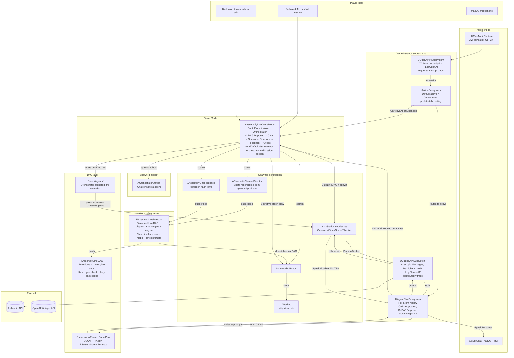

### Boot flow + mission entry points

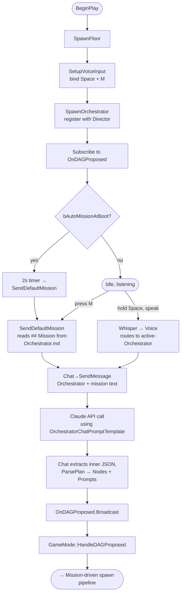

### Mission-driven spawn pipeline

How a single Claude reply becomes a running assembly line. This is the
hot path: `OnDAGProposed` → `ClearExistingLine` → write prompts →
spawn stations + workers → spawn cinematic → spawn feedback →
`StartAllSourceCycles`.

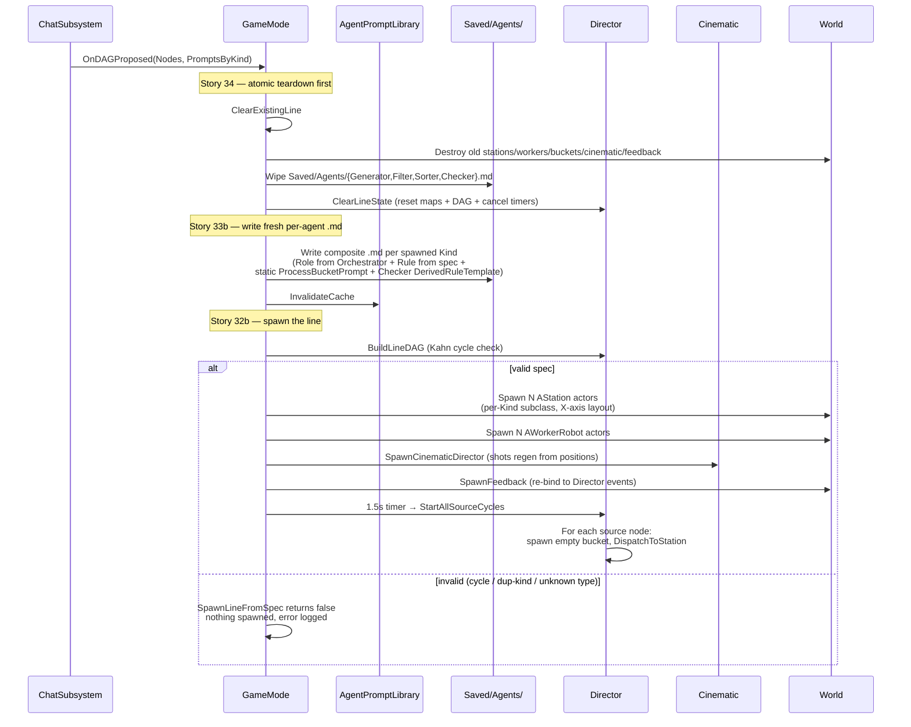

---

## The DAG executor — deep dive

The Story 31 work replaced the hardcoded `Generator → Filter → Sorter
→ Checker` chain with a pure-domain DAG layer. Stories 31a–31e
implemented the architecture; Story 32a–32b made the orchestrator emit
DAG specs at runtime; Story 33a–33b added file-driven kickoff +
Orchestrator-authored agents; Story 34 added atomic re-mission
teardown. The full design (with rejected alternatives + Sui code
references) lives in [Docs/DAG_Architecture.md](Docs/DAG_Architecture.md);
this section is the operator-level "what's in the codebase today" view.

### Why a DAG

The Orchestrator decides what the line looks like. To handle anything
beyond "linear chain of 4 fixed stations," dispatch needs an
authoritative topology — what feeds into what — that the runtime
consults instead of a hardcoded `EStationType` ladder. A DAG is the
minimum primitive: nodes (stations), forward edges (parent → child),
no cycles. The "no cycles" constraint is what makes the dispatch
event loop terminating instead of livelocking.

Inspired by **Sui's Mysticeti / Bullshark consensus**: edges-on-child
only, lazy back-edge cache, iterative BFS for traversals, Kahn's
cycle check at build time, watermark GC (deferred). Stripped of
every consensus concern (signatures, stake, leader election, rounds,
RocksDB, certs).

### The four layers at a glance

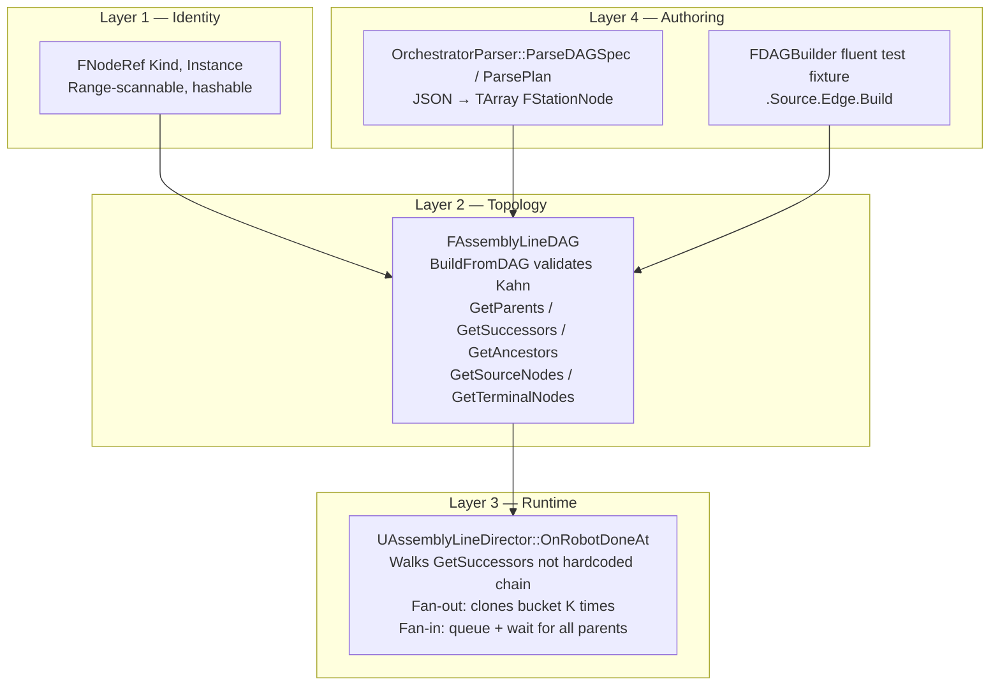

### Layer 1 — `FNodeRef` + `FStationNode`

[`Source/AssemblyLineSimul/DAG/AssemblyLineDAG.h`](Source/AssemblyLineSimul/DAG/AssemblyLineDAG.h):

```cpp
struct FNodeRef
{
    EStationType Kind = EStationType::Generator;
    int32        Instance = 0;     // 0..N within Kind

    bool operator==(...) const;    // (Kind, Instance) equality
    bool operator<(...)  const;    // lex order on (Kind, Instance)
};
FORCEINLINE uint32 GetTypeHash(const FNodeRef&);  // for TMap/TSet

struct FStationNode
{
    FNodeRef         Ref;
    FString          Rule;        // EffectiveRule for this station (for non-Checker)
    TArray<FNodeRef> Parents;     // forward edges, immutable
};
```

**Why typed `(Kind, Instance)` and not an opaque GUID:** Sui uses
`(round, author, digest)` precisely because it's range-scannable —
"all blocks at round R" is contiguous in any keyed map. Same payoff
for us: "all Filter nodes" is a useful range for debugging,
derived-rule walking, and per-kind chat routing. An opaque GUID
throws all that away.

**Why edges-on-child only:** Sui materializes back-edges (`children`)
**lazily** in `BlockInfo` only when traversal demands it. We do the
same — see Layer 2's `GetSuccessors`.

### Layer 2 — `FAssemblyLineDAG`

```cpp
class ASSEMBLYLINESIMUL_API FAssemblyLineDAG
{
public:
    bool BuildFromDAG(const TArray<FStationNode>& InNodes);  // Kahn cycle check
    TArray<FNodeRef> GetParents     (const FNodeRef&) const;  // immutable
    TArray<FNodeRef> GetSuccessors  (const FNodeRef&) const;  // lazy cache
    TArray<FNodeRef> GetSourceNodes ()                const;
    TArray<FNodeRef> GetTerminalNodes()               const;
    TArray<FNodeRef> GetAncestors   (const FNodeRef&) const;  // iterative BFS
    const FStationNode* FindNode    (const FNodeRef&) const;
    int32 NumNodes()                                  const;

private:
    TArray<TSharedRef<const FStationNode>> Nodes;     // insertion order
    TMap<FNodeRef, int32>                  RefToIndex;
    mutable bool                           bSuccessorCacheBuilt = false;
    mutable TMap<FNodeRef, TArray<FNodeRef>> SuccessorCache;
};
```

**`BuildFromDAG` runs Kahn's algorithm.** It computes in-degree per
node, repeatedly removes nodes with in-degree 0, decrements the
in-degree of their children, and aborts on a cycle:

```mermaid
flowchart TD
  Start([BuildFromDAG]) --> Compute[For each node N:<br/>in_degree[N] := Parents.Num]
  Compute --> Init[Queue := all nodes with in_degree == 0]
  Init --> Loop{Queue empty?}
  Loop -->|no| Pop["N := Queue.Pop()<br/>Visited++<br/>For each child C:<br/>  in_degree[C]--<br/>  if in_degree[C] == 0:<br/>    Queue.Push(C)"]
  Pop --> Loop
  Loop -->|yes| Check{Visited == NumNodes?}
  Check -->|yes — full drain| Done([return true])
  Check -->|no — leftovers form a cycle| Cycle["log Error: cycle detected<br/>Reset DAG<br/>return false"]
```

The `OrchestratorParser` and `SpawnLineFromSpec` both honor the
`false` return: a cyclic spec produces zero spawned actors and a
clear log explaining why.

**`GetSuccessors` is the lazy back-edge cache.** Forward edges
(`Parents`) live in `FStationNode` immutably. Back edges
(`children`) are computed on first call and memoized:

```cpp
TArray<FNodeRef> FAssemblyLineDAG::GetSuccessors(const FNodeRef& Node) const
{
    EnsureSuccessorCache();
    if (const TArray<FNodeRef>* Found = SuccessorCache.Find(Node))
        return *Found;
    return {};
}

void FAssemblyLineDAG::EnsureSuccessorCache() const
{
    if (bSuccessorCacheBuilt) return;
    SuccessorCache.Empty();
    for (const auto& Node : Nodes)
        for (const FNodeRef& P : Node->Parents)
            SuccessorCache.FindOrAdd(P).Add(Node->Ref);
    bSuccessorCacheBuilt = true;
}
```

Pay-as-you-go: linear topologies that only need parent walks never
build the cache. The runtime dispatcher (Layer 3) hits it once per
node-completion event.

**Ancestor walks are iterative.** Direct lift from Sui's
`dag_state.rs::ancestors_at_round` — no recursion, an explicit work
queue, an "already visited" early exit:

```cpp
TArray<FNodeRef> FAssemblyLineDAG::GetAncestors(const FNodeRef& Node) const
{
    TArray<FNodeRef> Out;
    TSet<FNodeRef>   Visited;
    TArray<FNodeRef> Queue;

    for (const FNodeRef& P : GetParents(Node)) Queue.Push(P);
    while (Queue.Num() > 0)
    {
        const FNodeRef N = Queue.Pop();
        bool bAlready = false;
        Visited.Add(N, &bAlready);
        if (bAlready) continue;
        for (const FNodeRef& P : GetParents(N)) Queue.Push(P);
        Out.Add(N);
    }
    return Out;
}
```

**No recursion anywhere in the DAG layer.** Sui learned the hard way
that recursive traversal blows the stack on deep DAGs; we follow the
same rule even at our (currently small) scale.

### Layer 3 — Runtime dispatch (fan-out, fan-in, ancestor walks)

[`UAssemblyLineDirector::OnRobotDoneAt`](Source/AssemblyLineSimul/AssemblyLineDirector.cpp)
is where the DAG meets gameplay. When a worker finishes carrying a
bucket through its station's `ProcessBucket`, this fires.

For most nodes (single successor, no fan-in at the destination), the
dispatch is just *"look up the next node, hand the bucket to its
worker"* — same cost as the old hardcoded chain.

**Fan-out (one parent → K successors).** When `GetSuccessors(Node)`
returns more than one, the bucket gets cloned K times via
`ABucket::CloneIntoWorld` (deep copy of `Contents` + materials), one
clone dispatched to each branch. The original is destroyed so the K
clones aren't ambiguous-looking duplicates.

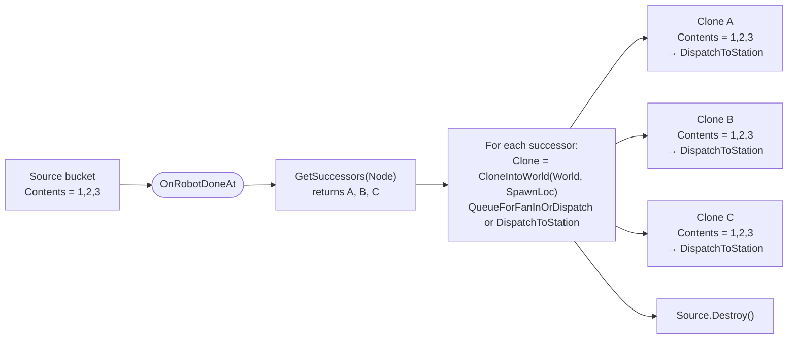

**Fan-in (one child ← K parents).** When a child has more than one
parent in the DAG, dispatch is queued instead of immediate. Two maps
on the Director hold the gate state:

- `WaitingFor[Child] : TSet<FNodeRef>` — parents not yet arrived for
  the current cycle. Lazily initialized from `GetParents(Child)` on
  first arrival.
- `InboundBuckets[Child] : TArray<TWeakObjectPtr<ABucket>>` — the
  buckets queued so far; weak-ptr for safety against destruction
  windows.

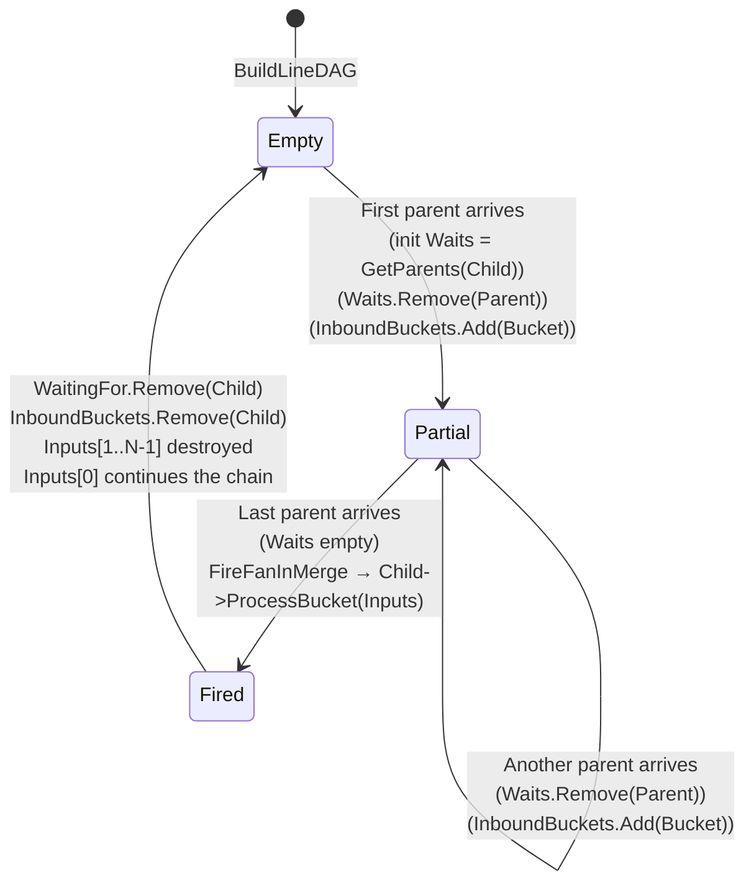

Once `Waits.IsEmpty()`, `FireFanInMerge` fires the child's
`ProcessBucket(Inputs)`. After completion, `Inputs[0]` continues the
dispatch chain (it survives, carrying the merge result); `Inputs[1..N-1]`
are destroyed. The agent decides what the merge means — concatenate,
diff, vote, pick one — by reading the multi-input array in its
`ProcessBucket`.

The wait-state resets per cycle (the merge clears `WaitingFor[Child]`
and `InboundBuckets[Child]` on completion), so successive cycles
re-fan-in correctly.

**Ancestor walks for the Checker's derived rule.**
[`ACheckerStation::GetEffectiveRule`](Source/AssemblyLineSimul/StationSubclasses.cpp)
calls `Director->GetDAG().GetAncestors(CheckerNodeRef)` and composes
each ancestor's `CurrentRule` into the verdict prompt at read time.
Mid-flight rule changes upstream automatically reach the Checker
without needing a recompile or a re-spawn — the next bucket through
the Checker reads fresh ancestor rules. For the typical linear
4-station mission this resolves identically to the old hardcoded
type-lookup; for fan-in topologies it gets the right multi-source
composition for free.

### Layer 4 — Authoring (parser + builder)

The DAG is consumed by Layer 3 but **authored** by two paths:

**Production: `OrchestratorParser::ParsePlan`**
([Source/AssemblyLineSimul/DAG/OrchestratorParser.cpp](Source/AssemblyLineSimul/DAG/OrchestratorParser.cpp))
parses the Orchestrator's reply object — the full `{"reply":..., "dag":{"nodes":[...]}, "prompts":{...}}`
shape — and returns both `TArray<FStationNode>` and a
`TMap<EStationType, FString>` of Orchestrator-authored Role prose.
Two passes:

1. Iterate `dag.nodes`, assign each node an `FNodeRef{Kind, Instance}`
   (Instance = N-th node of that Kind, zero-indexed).
2. Resolve each node's `parents` array of JSON IDs against the
   first-pass `id → FNodeRef` map.

Failure modes: malformed JSON, unknown station type, undeclared
parent ID, missing `dag.nodes` array → returns `false` + Error log
under `LogOrchestrator`. The optional `prompts` field is non-fatal:
absent → empty map; unknown station-type key → Warning + skipped
entry.

**Tests: `FDAGBuilder` fluent fixture**
([Source/AssemblyLineSimul/DAG/DAGBuilder.h](Source/AssemblyLineSimul/DAG/DAGBuilder.h)) —
zero-overhead inline builder that reads in DAG terms instead of array
literals:

```cpp
const FNodeRef Gen{EStationType::Generator, 0};
const FNodeRef Flt{EStationType::Filter,    0};
const FNodeRef Srt{EStationType::Sorter,    0};
const FNodeRef Chk{EStationType::Checker,   0};

const TArray<FStationNode> Spec = FDAGBuilder()
    .Source(Gen)
    .Edge(Gen, Flt)
    .Edge(Flt, Srt)
    .Edge(Srt, Chk)
    .Build();

Director->BuildLineDAG(Spec);
```

`AddUnique`-on-parents prevents accidental duplicate edges. Used
across every fan-out / fan-in spec.

### Worked example: the canonical mission as a DAG

The default mission ("generate ten random integers, filter primes,
sort ascending, then check") becomes a 4-node linear DAG. End-to-end
trace from spoken text to spawned actors:

**1. Operator triggers a mission** — presses M (or speaks). The
mission text reaches Claude wrapped in `OrchestratorChatPromptTemplate`.

**2. Claude returns** (schematic):

```json
{
  "reply": "Spinning up a 4-station line...",
  "dag": {
    "nodes": [
      {"id":"gen", "type":"Generator", "rule":"Generate exactly ten random integers between 1 and 100", "parents":[]},
      {"id":"flt", "type":"Filter",    "rule":"Keep only the prime numbers",                              "parents":["gen"]},
      {"id":"srt", "type":"Sorter",    "rule":"Sort the survivors strictly ascending",                    "parents":["flt"]},
      {"id":"chk", "type":"Checker",   "rule":"Verify against the three rules and report",                "parents":["srt"]}
    ]
  },
  "prompts": {
    "Generator": "You are the source of fresh integer batches...",
    "Filter":    "You sift the wheat from the chaff...",
    "Sorter":    "You impose order on what arrives...",
    "Checker":   "You are the final word on whether a bucket passes..."
  }
}
```

**3. `ParsePlan` produces:**

```cpp
TArray<FStationNode> Nodes = {
    { {Generator, 0}, "Generate exactly ten random integers ...",  {} },
    { {Filter,    0}, "Keep only the prime numbers",                { {Generator, 0} } },
    { {Sorter,    0}, "Sort the survivors strictly ascending",      { {Filter,    0} } },
    { {Checker,   0}, "Verify against the three rules and report",  { {Sorter,    0} } },
};
TMap<EStationType, FString> PromptsByKind = {
    { Generator, "You are the source of fresh integer batches..." },
    { Filter,    "You sift the wheat from the chaff..." },
    ...
};
```

**4. `Director->BuildLineDAG(Nodes)`** runs Kahn's:
- in_degrees: `{G:0, F:1, S:1, C:1}`. Queue starts with `{G}`.
- Pop G, decrement F → in_degree(F) = 0, push F. Queue: `{F}`.
- Pop F, decrement S → 0, push S. Queue: `{S}`.
- Pop S, decrement C → 0, push C. Queue: `{C}`.
- Pop C. Done. Visited == 4 == NumNodes → return true.

**5. Topology after `BuildFromDAG`:**

```
       parents: []         parents: [G:0]      parents: [F:0]      parents: [S:0]
   ┌──────────────┐    ┌──────────────┐    ┌──────────────┐    ┌──────────────┐
   │ Generator G:0│───▶│  Filter F:0  │───▶│  Sorter S:0  │───▶│ Checker C:0  │
   │ rule: "Gen…" │    │ rule: "Keep…"│    │ rule: "Sort…"│    │ rule: "Ver…" │
   └──────────────┘    └──────────────┘    └──────────────┘    └──────────────┘
        SOURCE                                                       TERMINAL
```

GetSourceNodes returns `[G:0]`, GetTerminalNodes returns `[C:0]`,
GetAncestors(C:0) returns `[S:0, F:0, G:0]`.

**6. `WriteOrchestratorAuthoredPrompts`** writes four files under
`Saved/Agents/`. Each composite body is:

```markdown
# Filter agent (orchestrator-authored, Story 33b)

## Role
You sift the wheat from the chaff — every integer the Generator
hands you is examined against the strict definition of primality...

## DefaultRule
Keep only the prime numbers

## ProcessBucketPrompt
You are the Filter agent on an assembly line. Apply this rule...
RULE: {{rule}}
INPUT: [{{input}}]
Respond with ONLY a JSON object on a single line, no markdown:
{"result":[<integers>]}
```

`AgentPromptLibrary::InvalidateCache` runs next so freshly-spawned
stations load the Saved/ override (not the cached Content/ default).

**7. `SpawnLineFromSpec(Nodes)`** — for each node in spec order,
spawns the matching `AStation` subclass at `LineOrigin + i ×
StationSpacing`, sets `CurrentRule = Nodes[i].Rule`, registers with
the Director, spawns one `AWorkerRobot` at the station's
`WorkerStandPoint`, and registers it.

**8. `SpawnCinematicDirector`** walks the spawned stations (via
`Director->GetDAG().GetSourceNodes() + GetAncestors(terminals)`),
emits a single wide-overview shot at the centroid + one closeup per
station, writes them into `Cinematic->Shots`. Calls `BindToAssemblyLine`
+ `Start`.

**9. `SpawnFeedback`** spawns the red/green flash actor, binds to
Director's `OnCycleCompleted` and `OnCycleRejected`.

**10. After 1.5 s, `Director->StartAllSourceCycles`** walks
`DAG.GetSourceNodes()` (just `[G:0]` for this DAG), spawns an empty
bucket at G's input slot, dispatches it. The cycle begins.

### Re-missioning teardown sequence

When a second mission arrives mid-session (`HandleDAGProposed` fires
again), the runtime tears down the previous line atomically before
spawning the new one:

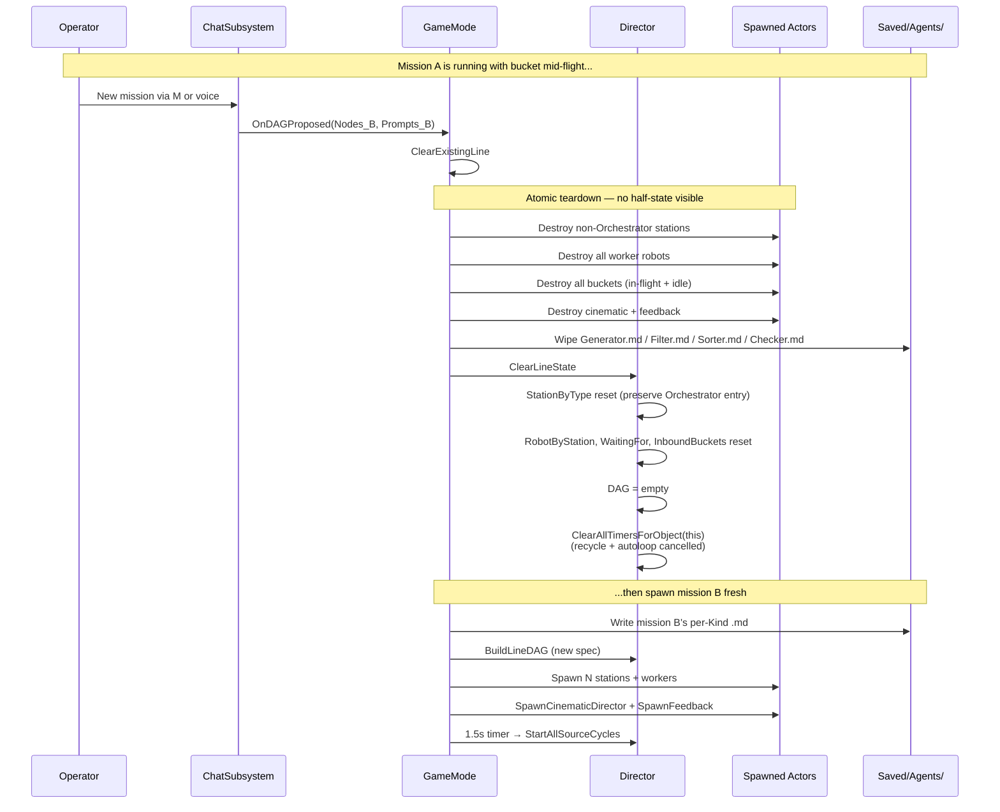

**What survives across re-missioning:** the Orchestrator station, the
chat history in `UAgentChatSubsystem`, the floor tiles. Everything
else is fresh.

**What enables the timer cancel:** the recycle and auto-loop timers
in `OnRobotDoneAt` use `FTimerDelegate::CreateWeakLambda(this, ...)`
so `World->GetTimerManager().ClearAllTimersForObject(Director)`
catches them. With the older `CreateLambda` form they'd fire
post-clear and dispatch into a destroyed station.

### What we deliberately did NOT do

Design choices recorded so the next person doesn't relitigate them:

- **No cycles, ever.** Validated at `BuildFromDAG`. A cycle is an
  error, not a runtime concern.
- **No back-edges materialized eagerly.** Lazy via `GetSuccessors`'s
  cache on first call.
- **No recursive traversal anywhere** — every walk is iterative with
  an explicit work queue.
- **No reference counting for cleanup.** When clear, we destroy actors
  and reset maps wholesale; in-flight Claude callbacks bail safely
  via `TWeakObjectPtr`.
- **No `ProcessBucket` overload** — one signature: `TArray<ABucket*>`.
  Single-parent stations just read `Inputs[0]`.
- **No global executor singleton.** `FAssemblyLineDAG` lives on
  `UAssemblyLineDirector` (a `UWorldSubsystem`).
- **No persistence beyond in-memory.** A `Store` trait was sketched
  in [Docs/DAG_Architecture.md](Docs/DAG_Architecture.md) but
  deliberately deferred — the demo doesn't need crash survival.
- **No watermark GC implementation yet.** The struct field is
  reserved; the real cleanup story is the wholesale teardown in
  Story 34. If a long-running session ever needs it, the watermark
  pattern is documented and ready.
- **No multi-instance per Kind in v1** (e.g. two Filters in one
  mission). The DAG executor itself supports it; `SpawnLineFromSpec`
  rejects it because chat / voice routing currently keys on
  `EStationType`. Lifting requires a `FNodeRef → AWorkerRobot` map
  refactor and chat-routing disambiguation. Deferred.

---

## Other flows

### Per-cycle pipeline

The cycle for the typical *"generate, filter, sort, check"* linear
mission. Fan-out / fan-in topologies follow the same dispatch with
cloning + the wait gate.


### Voice loop

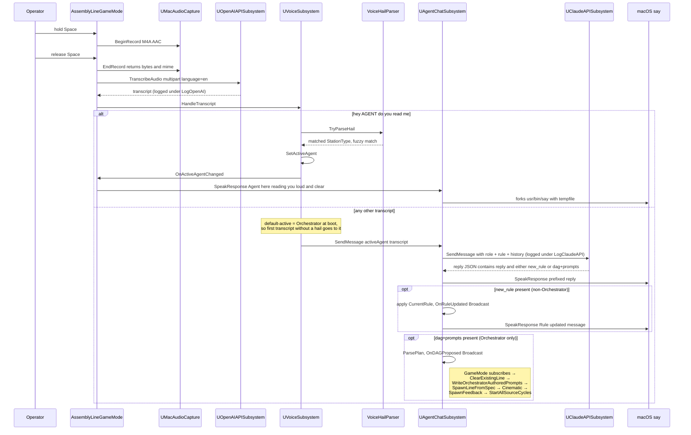

### Chat / rule-update flow

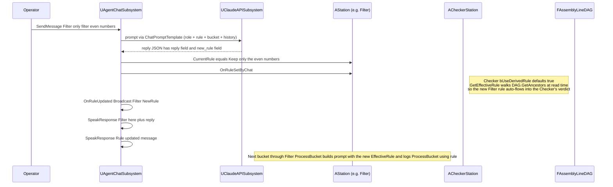

### Orchestrator-authored prompt pipeline

When the Orchestrator returns a `dag` plus a `prompts` object, the
runtime composes a complete `.md` per spawned Kind by combining the
Orchestrator-authored Role with the static contract sections from
`Content/Agents/`. Files land in `Saved/Agents/` which the loader
prefers over `Content/Agents/` — same precedence pattern as the
API-key loader.

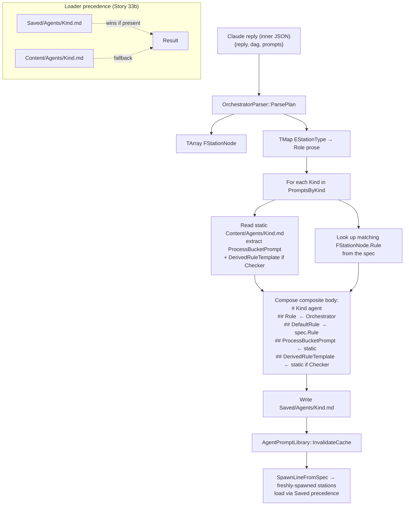

The static contract sections (`ProcessBucketPrompt` with its
`{"result":[…]}` JSON contract; `DerivedRuleTemplate` for the
Checker) are deliberately NOT authored by the Orchestrator — a
botched Role is harmless prose, but a botched parse contract would
break gameplay.

### Cinematic camera state machine

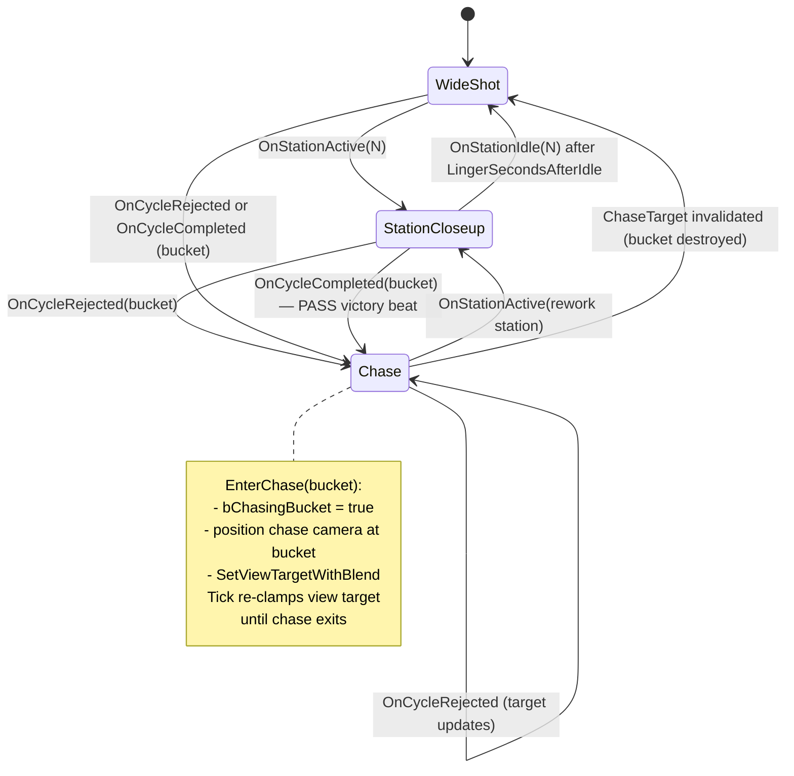

The shot list is **regenerated from spawned-station positions** when
the line materializes (Story 32b). One wide-overview at the spawned
line's centroid + one closeup per spawned station. The hardcoded
`StationCount = 4` layout is gone. Re-missioning destroys the
cinematic and re-spawns it from the new spec's positions
(Story 34).

## User stories

Stories 1–13 were implemented before the formal `Stories/` folder
existed; their full intent lives in commit messages (`git log
--oneline | tail -30`). Stories 14+ each have a markdown spec under
`Stories/`.

### Phase 1 — Skeleton (stories 1–2)
- **Story 1** ([`155e28b`](https://github.com/eyupgurel/AssemblyLineSimul/commit/155e28b)) — Initial scaffold: 4 stations, 4 workers, async ProcessBucket, basic FSM, the Checker calls Claude for QA, headless `FullCycleFunctionalTest` proves an end-to-end cycle reaches accept.
- **Story 2** ([`0d06f33`](https://github.com/eyupgurel/AssemblyLineSimul/commit/0d06f33)) — Worker FSM stranding fix: sync stations were getting an `Idle` overwrite on completion; added a "stay in current state if completion already advanced us" guard plus a visible LLM "thinking" beat for the Checker.

### Phase 2 — Visual basics (stories 3–5)
- **Story 3** ([`1f7c42e`](https://github.com/eyupgurel/AssemblyLineSimul/commit/1f7c42e)) — Workers can adopt a designer-assigned skeletal mesh; per-station tint via dynamic material instances on the body.
- **Story 4** ([`5521db6`](https://github.com/eyupgurel/AssemblyLineSimul/commit/5521db6)) — Composite mech body from 6 engine `BasicShapes` primitives.
- **Story 5** ([`861ede4`](https://github.com/eyupgurel/AssemblyLineSimul/commit/861ede4)) — Per-station UMG `UStationTalkWidget` (deleted in Story 23).

### Phase 3 — Cinematic & feedback (stories 6–9)
- **Story 6** ([`c3b2f15`](https://github.com/eyupgurel/AssemblyLineSimul/commit/c3b2f15)) — `ACinematicCameraDirector` with declarative `Shots[]`, auto-advance, reactive Checker jump.
- **Story 7** ([`20c7e23`](https://github.com/eyupgurel/AssemblyLineSimul/commit/20c7e23)) — Bumped the FullCycle test `TimeLimit` to fit a real Claude round-trip.
- **Story 8** ([`1f75da4`](https://github.com/eyupgurel/AssemblyLineSimul/commit/1f75da4)) — Designers can swap `UStationTalkWidget` for a Blueprint subclass.
- **Story 9** ([`68b1aad`](https://github.com/eyupgurel/AssemblyLineSimul/commit/68b1aad)) — `AAssemblyLineFeedback` flashes transient green/red point lights on Checker accept / reject.

### Phase 4 — Bucket visualisation (stories 10–11)
- **Story 10** ([`abce2ad`](https://github.com/eyupgurel/AssemblyLineSimul/commit/abce2ad)) — Bucket renders contents as numbered spheres inside a 12-edge wireframe crate.
- **Story 11** ([`4fe0d46`](https://github.com/eyupgurel/AssemblyLineSimul/commit/4fe0d46)) — Spheres become billiard-style: per-number color, runtime canvas-rendered numbers.

### Phase 5 — Cinematic polish (story 12)
- **Story 12** ([`b5fb752`](https://github.com/eyupgurel/AssemblyLineSimul/commit/b5fb752) + [`5c5c3a3`](https://github.com/eyupgurel/AssemblyLineSimul/commit/5c5c3a3) + [`ce1796a`](https://github.com/eyupgurel/AssemblyLineSimul/commit/ce1796a)) — Reactive station closeups with wide-shot resume, slowed pacing, workbench mesh on each station.

### Phase 6 — LLM-driven everything (story 13)
- **Story 13** ([`871b43c`](https://github.com/eyupgurel/AssemblyLineSimul/commit/871b43c) + [`37d2fe5`](https://github.com/eyupgurel/AssemblyLineSimul/commit/37d2fe5)) — Every station's `ProcessBucket` becomes async LLM-driven; chat subsystem updates `CurrentRule` per agent.

### Phase 7 — Voice & output channels (stories 14–15)
- **[Story 14](Stories/Story_14_Voice_Driven_Agent_Dialogue.md)** — Push-to-talk → Whisper → hail parser → sticky-context routing. Whisper pinned to `language=en`.
- **[Story 15](Stories/Story_15_Audible_Checker_Verdicts.md)** — `AStation::SpeakAloud` does panel + macOS `say` together; Checker uses it for both PASS and the verbose REJECT complaint.

### Phase 8 — Failure handling (stories 16–17)
- **[Story 16](Stories/Story_16_Camera_Follows_Rejected_Bucket.md)** — Cinematic chase camera. On REJECT the camera follows the bucket back to the rework station; on PASS the camera holds a "victory beat".
- **[Story 17](Stories/Story_17_Robust_Rework_Flow.md)** — Mid-flight rule changes don't cancel the in-flight bucket; empty bucket after rework triggers a visible recycle and a fresh Generator cycle.

### Phase 9 — Worker / scene polish (stories 18–20)
- **[Story 18](Stories/Story_18_Worker_Visual_Polish.md)** — UE5 Manny mannequin (anim swap, 1.5× scale).
- **[Story 19](Stories/Story_19_Active_Agent_Worker_Glow.md)** — Active-speaker green light on the worker (was on the station).
- **[Story 20](Stories/Story_20_Industrial_Floor.md)** — Stylized metallic-floor asset pack tiled 60×60 under the line.

### Phase 10 — Visual cleanup pivot (stories 21–25)
- **Story 21** — *Abandoned.* Fab "Free Fantasy Work Table" prop pivot offset was too fragile; reverted.
- **[Story 22](Stories/Story_22_Cleanup_After_Gold_Bucket.md)** — Cleanup pass after the gold-bucket pivot.
- **[Story 23](Stories/Story_23_Strip_InWorld_Text.md)** — Stripped every in-world text label. TTS audio preserved.
- **[Story 24](Stories/Story_24_Filter_Selected_Glow.md)** — *Superseded by Story 25.*
- **[Story 25](Stories/Story_25_Filter_Selection_Preview.md)** — Filter selection preview: SELECTED balls glow gold for one second while REJECTED balls remain visible — audience sees the contrast.

### Phase 11 — Operator-experience polish (stories 26–28)
- **[Story 26](Stories/Story_26_Terse_Pass_And_Silence_Agents.md)** — Checker PASS is just **"Pass."**; Space silences in-flight agent voice.
- **[Story 27](Stories/Story_27_Externalize_Agent_Prompts.md)** — Every prompt template moves out of `.cpp` literals into editable `.md` under `Content/Agents/`. New `AgentPromptLibrary`.
- **[Story 28](Stories/Story_28_Remove_Tab_Chat_Widget.md)** — Strip the Tab-toggled `UAgentChatWidget`. Voice push-to-talk is now the only input.

### Phase 12 — Observability (stories 29–30)
- **[Story 29](Stories/Story_29_Log_Claude_Traffic.md)** — Every Claude prompt + response logged under `LogClaudeAPI`.
- **[Story 30](Stories/Story_30_Log_Whisper_Traffic.md)** — Mirror for Whisper under `LogOpenAI`. Together: full `mic → transcript → Claude prompt → Claude reply → station behavior` chain reproducible from logs.

### Phase 13 — DAG executor (stories 31a–31e)
- **[Story 31a](Stories/Story_31a_DAG_Foundation.md)** — `FNodeRef`, `FStationNode`, `FAssemblyLineDAG` with Kahn's cycle check; lazy back-edge cache; iterative BFS for `GetAncestors`. Director's `OnRobotDoneAt` consults `GetSuccessors`. Checker derived rule walks ancestors. Linear chain still byte-identical.
- **[Story 31b](Stories/Story_31b_Multi_Input_Signature.md)** — `AStation::ProcessBucket` signature changes to `(const TArray<ABucket*>& Inputs, …)`. Sets up multi-input fan-in.
- **[Story 31c](Stories/Story_31c_Fan_Out.md)** — K > 1 successors → clone bucket K times via `ABucket::CloneIntoWorld`, dispatch each clone, destroy original.
- **[Story 31d](Stories/Story_31d_Fan_In.md)** — K > 1 parents → wait-and-collect gate. `WaitingFor` + `InboundBuckets`. Merge fires when last parent arrives. `Inputs[0]` survives, `Inputs[1..N-1]` destroyed. Wait state resets per cycle.
- **[Story 31e](Stories/Story_31e_DAG_Test_Builder.md)** — `FDAGBuilder` fluent test fixture. Replaces hand-rolled `FStationNode{...}` literals across 6 spec sites.

### Phase 14 — Orchestrator (stories 32a–32b)
- **[Story 32a](Stories/Story_32a_Orchestrator_Agent.md)** — `EStationType::Orchestrator`, `Content/Agents/Orchestrator.md`, `OrchestratorChatPromptTemplate` (asks for `dag` instead of `new_rule`), `AOrchestratorStation`, `OrchestratorParser::ParseDAGSpec`. Pure additive prep work.
- **[Story 32b](Stories/Story_32b_Mission_Driven_Boot.md)** — The headline. `SpawnAssemblyLine` removed; `SpawnOrchestrator` (boot, one chat-only station) + `SpawnLineFromSpec` (mission, N stations + workers + DAG built). `AgentChatSubsystem::OnDAGProposed` fires; `BeginPlay` subscribes and runs spawn → cinematic regen → `StartAllSourceCycles`. Voice default-active = Orchestrator. v1 enforces single-instance-per-kind.

### Phase 15 — File-driven mission (story 33a)
- **[Story 33a](Stories/Story_33a_File_Driven_Mission.md)** — Second entry point to the mission pipeline. `Orchestrator.md` gets a `## Mission` section with the canonical demo text in operator-voice. New `SendDefaultMission()` reads it and routes through chat. Bound to **M** (PIE eats Enter for editor shortcuts). New `bAutoMissionAtBoot` flag fires the mission ~2 s after BeginPlay for hands-free recordings. Voice path unchanged.

### Phase 16 — Orchestrator-authored prompts (story 33b)
- **[Story 33b](Stories/Story_33b_Orchestrator_Authored_Prompts.md)** — `OrchestratorChatPromptTemplate` extended to ask for a sibling `prompts` object (one Role paragraph per spawned station). New `OrchestratorParser::ParsePlan` extracts both `dag` and `prompts`. `OnDAGProposed` signature extended to two params. `WriteOrchestratorAuthoredPrompts` composes Role + spec.Rule + static `ProcessBucketPrompt` (+ Checker `DerivedRuleTemplate`) into a complete `.md` per Kind, written to `Saved/Agents/`. New `AgentPromptLibrary::InvalidateCache`. Loader checks `Saved/Agents/` before `Content/Agents/`. Bumped `MaxTokens` 512 → 4096 (the Orchestrator's full reply was getting truncated mid-JSON).

### Phase 17 — Re-missioning teardown (story 34)
- **[Story 34](Stories/Story_34_Re_Missioning_Teardown.md)** — Atomic teardown when a new DAG arrives. `ClearExistingLine` destroys non-Orchestrator stations + workers + buckets + cinematic + feedback; wipes `Saved/Agents/<Kind>.md`. `ClearLineState` resets Director maps + DAG; cancels timers via `ClearAllTimersForObject(this)` (recycle/auto-loop refactored to `CreateWeakLambda` so they're trackable). `HandleDAGProposed` orchestrates: clear → write prompts → invalidate cache → spawn → cinematic → feedback → start cycles. Orchestrator station + chat history survive.

## Testing

The project uses **UE Automation Specs** (BDD-style `Describe` / `It`)
plus one **FunctionalTest** actor for end-to-end coverage.

**Run the full suite headless:**

```bash
"/Users/Shared/Epic Games/UE_5.7/Engine/Binaries/Mac/UnrealEditor-Cmd" \
    "$PWD/AssemblyLineSimul.uproject" \
    -ExecCmds="Automation RunTests AssemblyLineSimul; Quit" \
    -unattended -nullrhi -log -NoSplash -ABSLOG=/tmp/auto.log
```

Then `grep -c 'Result={Success}' /tmp/auto.log` for a pass count and
`grep -c 'Result={Fail}' /tmp/auto.log` for a fail count.

**Current coverage: 158 specs across 16 spec files plus the
FunctionalTest** (every spec passes against real Anthropic + OpenAI
APIs when keys are configured; specs that don't need network use
synthesised LLM responses fed through public test seams).

| Spec file | What it locks down |
| --- | --- |
| `AgentChatSubsystemSpec` | Per-agent history isolation, prompt construction, `SpeakResponse` test hook, `OnRuleUpdated` broadcast on chat-driven rule change, `StopSpeaking` empties active-say-handle store, **`OnDAGProposed` (Story 32b/33b) — broadcasts on Orchestrator dag-spec replies with parsed nodes + prompts; silent on `dag: null` and on non-Orchestrator agents; works even when Claude wraps JSON in prose / fences (regression test from a Story 33b PIE-check bug)**. |
| `AgentPromptLibrarySpec` | `LoadAgentSection` returns the right `.md` section; `FormatPrompt` resolves `{{name}}`; **Orchestrator `Mission` section non-empty plain-English (Story 33a); `Saved/Agents/` precedence over `Content/Agents/` (Story 33b); `InvalidateCache` forces re-read on next load**. |
| `AssemblyLineDAGSpec` | Story 31a DAG: `BuildFromDAG` rejects cycles via Kahn's algorithm (returns false + leaves DAG empty); `GetParents` / `GetSuccessors` / `GetAncestors` produce deterministic-order results; lazy back-edge cache builds on first `GetSuccessors` call; source/terminal node detection. |
| `AssemblyLineDirectorSpec` | Worker phase events re-broadcast as `OnStationActive`; empty-bucket recycle path; **fan-out (Story 31c) clones K times and destroys source**; **fan-in (Story 31d) wait-and-collect gate fires merge once both parents arrive and re-arms per cycle**; **`StartAllSourceCycles` (Story 32b) dispatches one bucket per source node**; **`ClearLineState` (Story 34) — empties StationByType (preserves Orchestrator), RobotByStation, WaitingFor, InboundBuckets; resets DAG to NumNodes==0; cancels recycle/autoloop timers via the `CreateWeakLambda` refactor**. |
| `AssemblyLineFeedbackSpec` | Accept/reject light spawning at the bucket location. |
| `AssemblyLineGameModeSpec` | **`SpawnOrchestrator` (Story 32b) spawns exactly one `AOrchestratorStation` and zero workers + registers with the Director**; **`SpawnLineFromSpec` spawns one station + worker per node, applies per-node rules, picks the right subclass per `Kind`, rejects duplicate-kind specs (AC32b.9), leaves the world untouched on cycles**; **`SpawnCinematicDirector` regenerates `Shots` from the spawned line — 4 stations → 5 shots, 2 stations → 3 shots, proves the count is data-driven not hardcoded**; **`SendDefaultMission` (Story 33a) reads Mission section + routes through chat; no-op when chat unavailable**; **`WriteOrchestratorAuthoredPrompts` (Story 33b) writes Saved/Agents/<Kind>.md with Role + spec.Rule + static ProcessBucketPrompt + Checker DerivedRuleTemplate preserved**; **`ClearExistingLine` (Story 34) destroys each actor class, preserves Orchestrator + AssemblyLineFloor tiles, no-op on empty world, wipes stale Saved/Agents/**; **`HandleDAGProposed` re-mission tests — second invocation leaves only mission B's actors (the original duplicate-bucket bug); preserves Orchestrator registration; in-flight bucket destroyed; subsequent reads pick up new mission's Saved/Agents/ Role**; propagates `WorkerRobotMeshAsset` / `BucketClass`; `SpawnFloor` (Story 20). |
| `BucketSpec` | Crate construction, `RefreshContents` add/remove, billiard MID wiring, `HighlightBallsAtIndices` (Story 25), **`CloneIntoWorld` (Story 31c) — distinct ABucket actor with copied Contents and propagated `BilliardBallMaterial`**. |
| `CinematicCameraDirectorSpec` | Shot looping/holding, reactive station jumps, return-to-resume on idle, chase enters/exits on cycle events, target updates on second rejection, PASS chase + null-bucket fallback. |
| `DAGBuilderSpec` | Story 31e fluent fixture: `Source` adds a parent-less node, `Edge(from, to)` adds an edge with `AddUnique` parent dedup, `Build()` returns the right `TArray<FStationNode>`. |
| `OpenAIAPISubsystemSpec` | Whisper multipart body shape: `language=en` pinned, `model=whisper-1`, file part with filename + MIME, raw audio bytes embedded verbatim. |
| `OrchestratorParserSpec` | Story 32a: empty / linear / fan-out / fan-in JSON specs parse correctly; malformed JSON, unknown station type, undeclared parent ID return false + Error log. **Story 33b `ParsePlan`: extracts the prompts object alongside dag; missing prompts non-fatal; unknown station-type key in prompts logs Warning and skips; malformed JSON returns false**. |
| `StationSpec` | `SpeakAloud` routes through chat subsystem TTS, Checker PASS speaks just "Pass.", REJECT keeps verbose complaint, LLM-unreachable PASS fallback also speaks "Pass." |
| `StationSubclassesSpec` | `AFilterStation::FindKeptIndices` (Story 25): input/kept index mapping with first-occurrence claiming. |
| `VoiceHailParserSpec` | Canonical hail pattern, case insensitivity, alternative confirmations, rejection of non-hails, fuzzy match (Levenshtein ≤ 2) for Whisper letter swaps. |
| `VoiceSubsystemSpec` | **Default-active = Orchestrator at construction (Story 32b)**, hail switches active agent, sticky-context command routing, second hail switches agent. |
| `WorkerRobotSpec` | FSM phase events, body-mesh assignment, tint MIDs, sync vs deferred completion. |
| `FullCycleFunctionalTest` | One full Generator → Filter → Sorter → Checker cycle reaches accept. Calls real Claude. |

The TDD discipline is **strict RED → GREEN → Refactor**:
1. Write a story doc under `Stories/Story_NN_…md` (or update an
   existing one).
2. Add failing spec(s) — confirm RED via headless sweep.
3. Implement the minimum code to flip them GREEN.
4. Run the full sweep — must stay all-green.
5. Commit with a message that names the story and lists the new spec count.

## Project layout

```
AssemblyLineSimul/
├── README.md                 ← you are here
├── AssemblyLineSimul.uproject
├── Build/
│   └── Mac/
│       ├── Resources/        ← engine-generated entitlements + plist template
│       └── Scripts/
│           └── fix_voice_in_packaged_app.sh  ← post-stage Info.plist + codesign fix
├── Config/
│   ├── DefaultEngine.ini     ← GlobalDefaultGameMode = BP_AssemblyLineGameMode +
│   │                           ExtraPlistData NSMicrophoneUsageDescription
│   └── DefaultGame.ini       ← +DirectoriesToAlwaysStageAsNonUFS=(Path="Secrets")
├── Docs/
│   ├── Agent_Instructions.md ← thin pointer to Content/Agents/ .md prompts
│   └── DAG_Architecture.md   ← Layer 1-5 design + 5 locked decisions + Sui refs
├── Content/
│   ├── BP_AssemblyLineGameMode.uasset
│   ├── BP_BilliardBucket.uasset
│   ├── L_AssemblyDemo.umap
│   ├── M_BilliardBall.uasset
│   ├── Agents/               ← Story 27: per-agent prompts (loaded by AgentPromptLibrary)
│   │   ├── ChatPrompt.md     ← shared chat templates (default + OrchestratorChatPromptTemplate)
│   │   ├── Generator.md
│   │   ├── Filter.md
│   │   ├── Sorter.md
│   │   ├── Checker.md
│   │   └── Orchestrator.md   ← Story 32a: chat-only meta agent + Story 33a Mission section
│   ├── Metallic_Floor/       ← Stylized Metallic Floor asset pack (Story 20)
│   └── Secrets/              ← gitignored API keys; auto-staged into packaged builds
│       ├── AnthropicAPIKey.txt
│       └── OpenAIAPIKey.txt
├── Saved/
│   └── Agents/               ← Story 33b: Orchestrator-authored .md overrides
│                                (loader prefers Saved/ over Content/; wiped on re-mission)
├── Source/AssemblyLineSimul/
│   ├── AssemblyLineGameMode.{h,cpp}    ← BeginPlay: Floor + Voice + Orchestrator
│   │                                     OnDAGProposed handler: ClearExistingLine →
│   │                                     WriteOrchestratorAuthoredPrompts → SpawnLineFromSpec →
│   │                                     SpawnCinematicDirector → SpawnFeedback → cycles
│   │                                     SendDefaultMission (M key, Story 33a)
│   ├── AssemblyLineDirector.{h,cpp}    ← Holds FAssemblyLineDAG; OnRobotDoneAt walks DAG
│   │                                     successors; fan-in wait gate; recycle;
│   │                                     ClearLineState (Story 34) + WeakLambda timers
│   ├── AssemblyLineTypes.h             ← EStationType (incl. Orchestrator), FStationProcessResult,
│   │                                     FAgentChatMessage
│   │
│   ├── Station.{h,cpp}                 ← base station: ActiveLight, SpeakAloud (TTS-only),
│   │                                     ProcessBucket(TArray<ABucket*>, OnComplete)
│   ├── StationSubclasses.{h,cpp}       ← Generator, Filter, Sorter, Checker, Orchestrator
│   │                                     Filter::FindKeptIndices for selection preview
│   │                                     Checker::GetEffectiveRule walks DAG ancestors
│   ├── WorkerRobot.{h,cpp}             ← FSM, UE5 Manny mannequin, green ActiveLight
│   ├── Bucket.{h,cpp}                  ← wireframe crate + billiard balls
│   │                                     CloneIntoWorld for Story 31c fan-out
│   │                                     HighlightBallsAtIndices for Filter selection
│   │
│   ├── DAG/                            ← Story 31 — pure-domain DAG layer
│   │   ├── AssemblyLineDAG.{h,cpp}     ← FNodeRef, FStationNode, FAssemblyLineDAG
│   │   ├── DAGBuilder.h                ← Story 31e fluent test fixture
│   │   └── OrchestratorParser.{h,cpp}  ← Story 32a/33b JSON spec parser (ParseDAGSpec + ParsePlan)
│   │
│   ├── ClaudeAPISubsystem.{h,cpp}      ← Anthropic /v1/messages POST + LogClaudeAPI trace
│   │                                     MaxTokens=4096 (Story 33b)
│   ├── OpenAIAPISubsystem.{h,cpp}      ← Whisper /v1/audio/transcriptions + LogOpenAI trace
│   ├── AgentChatSubsystem.{h,cpp}      ← per-agent chat, OnRuleUpdated, OnDAGProposed (TwoParams),
│   │                                     SpeakResponse (TTS), StopSpeaking
│   ├── AgentPromptLibrary.{h,cpp}      ← Story 27 — loads .md prompts; Story 33b — Saved/Agents/
│   │                                     precedence + InvalidateCache
│   ├── VoiceSubsystem.{h,cpp}          ← active-agent state (default = Orchestrator), routing
│   ├── VoiceHailParser.{h,cpp}         ← "hey <agent> do you read me" matcher (Levenshtein)
│   ├── MacAudioCapture.{h,mm}          ← AVAudioRecorder Obj-C++ bridge (Mac-only)
│   │
│   ├── CinematicCameraDirector.{h,cpp} ← shots (regen'd from spawned positions in Story 32b),
│   │                                     reactive jumps, chase camera
│   ├── AssemblyLineFeedback.{h,cpp}    ← red/green flash lights on Checker verdict
│   ├── JsonHelpers.h                   ← shared ExtractJsonObject for chatty LLM replies
│   │
│   └── Tests/                          ← all *Spec.cpp + the FunctionalTest actor
└── Stories/                            ← markdown specs for stories 14-34 (21 abandoned)
```

## External services & keys

| Service | Endpoint | Purpose | Where the key lives |
| --- | --- | --- | --- |
| **Anthropic Messages** | `POST /v1/messages` | Powers every station's `ProcessBucket` (Generator/Filter/Sorter/Checker reasoning + Orchestrator DAG-spec generation) and the chat subsystem (per-agent dialogue + rule updates). Default model `claude-sonnet-4-6`, `MaxTokens = 4096`. | `Content/Secrets/AnthropicAPIKey.txt` (preferred — auto-staged into packaged builds) or `Saved/AnthropicAPIKey.txt`. |
| **OpenAI Whisper** | `POST /v1/audio/transcriptions` | Push-to-talk speech → text. Multipart upload of M4A/AAC, `model=whisper-1`, `language=en`. | `Content/Secrets/OpenAIAPIKey.txt` or `Saved/OpenAIAPIKey.txt`. |
| **macOS `say`** | local fork/exec | Text → speech for every TTS line. | n/a — bundled with macOS. |

`UClaudeAPISubsystem::LoadAPIKey` and `UOpenAIAPISubsystem::LoadAPIKey`
both check `Saved/` then `Content/Secrets/` and log a `Display`-level
line on success. Story 29 (LogClaudeAPI) and Story 30 (LogOpenAI)
add per-call request/response tracing so you can reconstruct any
single PIE session's full LLM traffic from logs.

## Packaging a standalone build

**Editor:** *Platforms → Mac → Package Project →* pick an output folder.

The package contains:

- `<App>.app/Contents/UE/AssemblyLineSimul/Content/Secrets/AnthropicAPIKey.txt`
- `<App>.app/Contents/UE/AssemblyLineSimul/Content/Secrets/OpenAIAPIKey.txt`
- `<App>.app/Contents/UE/AssemblyLineSimul/Content/Agents/*.md` (the
  prompt bundle from Story 27 — must ship since `AgentPromptLibrary`
  reads them at runtime)

…all auto-staged via `+DirectoriesToAlwaysStageAsNonUFS` in
`Config/DefaultGame.ini`. **No manual key-copy step needed**, and
the sandboxed Mac container's writable `Saved/` dir is checked first
for both keys and the per-mission `.md` overrides.

Default GameMode is `BP_AssemblyLineGameMode` (set in
`Config/DefaultEngine.ini` so packaged builds use it).

### Post-stage fix-up: voice recognition (mandatory after every package)

`Config/DefaultEngine.ini` contains
`+ExtraPlistData=<key>NSMicrophoneUsageDescription</key>...` so the
mic-usage string *should* land in the packaged `Info.plist`
automatically — but UAT silently drops it in UE 5.7. Without that
key macOS denies mic access without ever prompting; AVAudioRecorder
records 3 s of silence; Whisper transcribes silence as `"you"`.

After every `RunUAT BuildCookRun` Mac package (or
*Platforms → Mac → Package Project*), run:

```bash
./Build/Mac/Scripts/fix_voice_in_packaged_app.sh
```

What it does:

1. Adds `NSMicrophoneUsageDescription` to the staged `Info.plist`.
2. Re-signs the bundle ad-hoc.

Optional `--reset-permission` resets macOS's mic permission cache for
the bundle id (`tccutil reset Microphone …`).

Once the script runs, launch the .app and grant mic permission when
prompted (or check **System Settings → Privacy & Security → Microphone**).
Voice should work.

## Known limitations / future work

- **Single instance per kind in the spawn pipeline (Story 32b
  AC32b.9).** The DAG executor itself supports multi-instance (e.g.
  two Filters branching off one Generator), but `SpawnLineFromSpec`
  rejects specs with duplicate kinds because chat / voice routing
  currently keys on `EStationType`. Lifting this requires refactoring
  `Director::RobotByStation` + `StationByType` to be keyed on
  `FNodeRef` and disambiguating chat/voice routing across instances
  of one kind. Deferred to a follow-up story.
- **Chat history grows unbounded across re-missions.** The
  Orchestrator's history accumulates every prior mission text. After
  ~5 missions the prompt gets long enough to hit Claude latency
  spikes. A "trim oldest" or "summarize prior missions" pass would
  help.
- **No persistence** of the spawned topology across sessions.
- **Visual spawn animation is instant** — stations and workers pop
  in. A staged build animation (one station materializing per beat)
  would sell the moment more.
- **macOS only**: `UMacAudioCapture` is the only voice-capture
  backend; voice flow degrades gracefully on other platforms.
- **Packaged-build mic permission needs the post-stage script** —
  see [Post-stage fix-up](#post-stage-fix-up-voice-recognition-mandatory-after-every-package).
- **TTS race**: `SpeakResponse` writes to a single
  `agent_say_buffer.txt` file. Concurrent speakers can rarely clobber
  each other's input file. Fix: per-call unique filenames or
  `osascript`.
- **No rework cap**: the Director will keep dispatching rejected
  buckets back to the rework station as long as the Checker keeps
  rejecting. By design (the demo wants to show the agents trying
  again), but in production you'd want a hard limit.
- **Filter selection preview only** — Sorter and Checker don't have
  an analogous "what changed?" highlight. The Sorter could flash
  reorder arrows, the Checker could outline rule-violators in red.
- **Watermark GC / `Store` trait deferred.** Sketched in
  [Docs/DAG_Architecture.md](Docs/DAG_Architecture.md) but not
  implemented. Story 34's wholesale teardown handles cleanup
  satisfactorily for the demo's lifetimes.
