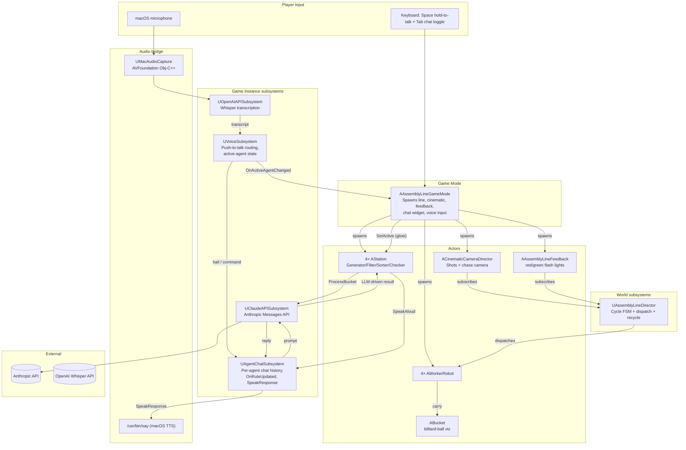
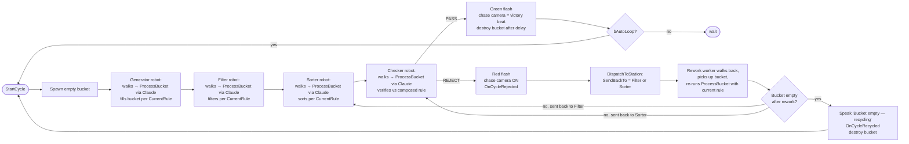
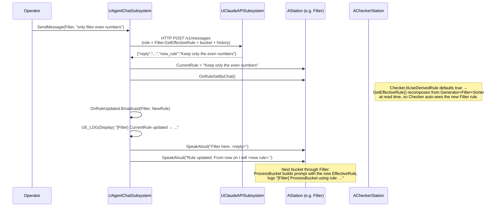
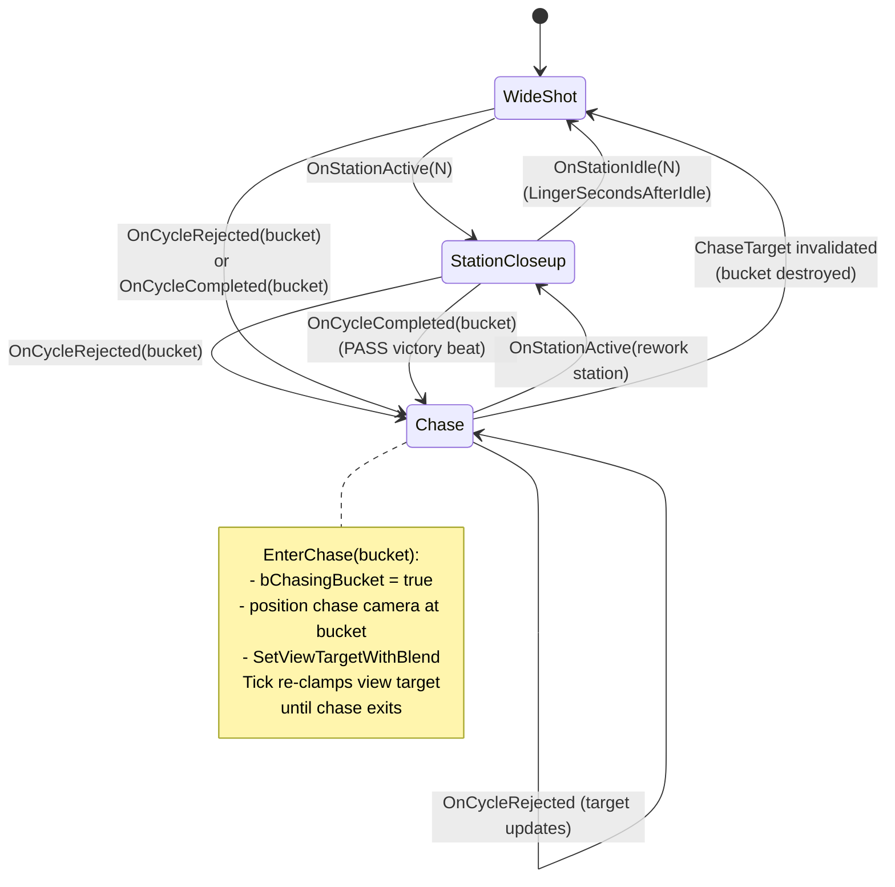

# AssemblyLineSimul

An Unreal Engine 5.7 demo where four AI agents — **Generator**, **Filter**,
**Sorter**, **Checker** — collaborate on a literal assembly line. Every
agent is driven by the **Anthropic Claude API**: the rules they follow
are plain‑English strings the operator can change on the fly via
**voice (OpenAI Whisper push‑to‑talk)** or text chat. The Checker auto‑
derives its rule from the upstream agents, calls out failures by name,
and the cinematic camera chases the rejected bucket back through the
pipeline so the audience can watch the agents recover from a bad cycle
in real time.

The project doubles as a worked example of:

- driving game behavior with LLMs (Claude Sonnet for reasoning, Whisper for STT, macOS `say` for TTS)
- a cinematic camera that reacts to gameplay events
- strict TDD‑style automation specs for non‑trivial UE features
- mid‑flight rule changes propagating through a stateful pipeline without breaking the cycle

## Table of contents

1. [What you see when you press Play](#what-you-see-when-you-press-play)
2. [Quick start](#quick-start)
3. [Architecture](#architecture)
   - [System overview](#system-overview)
   - [Per‑cycle pipeline](#per-cycle-pipeline)
   - [Voice loop](#voice-loop)
   - [Chat / rule‑update flow](#chat--rule-update-flow)
   - [Cinematic camera state machine](#cinematic-camera-state-machine)
4. [User stories](#user-stories)
5. [Testing](#testing)
6. [Project layout](#project-layout)
7. [External services & keys](#external-services--keys)
8. [Packaging a standalone build](#packaging-a-standalone-build)
9. [Known limitations / future work](#known-limitations--future-work)

---

## What you see when you press Play

Four robot workers stand at four stations laid out along a line. Each
station has:

- a worktable with a glass / wireframe crate ("bucket") for numbered billiard balls
- a 3D talk panel above the station that streams the agent's current dialogue
- a coloured rim light that turns on when the agent is the **active speaker**

When the cycle starts:

1. The **Generator** robot fills the bucket with a fresh batch of integers
   per its current rule (default: *"Generate 10 random integers in the
   range 1 to 100"*).
2. The **Filter** worker carries the bucket to its station and applies its
   rule (default: *keep only primes*).
3. The **Sorter** reorders the kept items (default: *strictly ascending*).
4. The **Checker** verifies the bucket against the *composed* rule chain
   ("Generator did X, Filter did Y, Sorter did Z — does this bucket fit?").
   - **PASS** → green light flashes, the camera holds a victory close‑up on
     the accepted bucket, then the next cycle spawns from the Generator.
   - **REJECT** → red light flashes, the Checker complains aloud naming
     every offending value and the responsible station, the rework worker
     carries the bucket back, and the **camera chases the bucket** until
     it docks at the rework station.

At any point you can press and hold **Space** to talk to a specific
agent: *"Hey Filter, do you read me?"* → Filter glows, replies *"Filter
here, reading you loud and clear. Go ahead."* → next push‑to‑talk gets
routed to Filter as a command (e.g. *"Only filter the odd numbers"*).
Filter replies via TTS, the rule visibly updates on its talk panel, and
every subsequent bucket flows through the new rule. The Checker's
derived rule auto‑updates too, so it correctly catches buckets that
made it through Filter on the *old* rule.

## Quick start

**Requirements:** macOS, UE 5.7, an Anthropic API key, an OpenAI API
key (for Whisper). Both keys are pay‑as‑you‑go API credits — *not* the
ChatGPT Plus / Claude Max subscriptions, which don't include API access.

```bash
# 1. Clone
git clone git@github.com:eyupgurel/AssemblyLineSimul.git
cd AssemblyLineSimul

# 2. Drop your API keys (gitignored, auto‑staged into packaged builds)
echo 'sk-ant-...' > Build/Secrets/AnthropicAPIKey.txt
echo 'sk-...'     > Build/Secrets/OpenAIAPIKey.txt

# 3. Build
"/Users/Shared/Epic Games/UE_5.7/Engine/Build/BatchFiles/Mac/Build.sh" \
    AssemblyLineSimulEditor Mac Development \
    -Project="$PWD/AssemblyLineSimul.uproject"

# 4. Open in editor
open AssemblyLineSimul.uproject
```

In the editor, hit **Play in Editor** (PIE). First Space‑press triggers a
macOS microphone permission prompt — click **Allow**.

## Architecture

### System overview



### Per‑cycle pipeline



### Voice loop

```mermaid
sequenceDiagram
  participant U as Operator
  participant GM as AssemblyLineGameMode
  participant Cap as UMacAudioCapture (.mm)
  participant AI as UOpenAIAPISubsystem
  participant V as UVoiceSubsystem
  participant Hail as VoiceHailParser
  participant Chat as UAgentChatSubsystem
  participant CA as UClaudeAPISubsystem
  participant Say as macOS say
  participant St as Active AStation

  U->>GM: hold Space
  GM->>Cap: BeginRecord (M4A AAC)
  Note over Cap: AVAudioRecorder writes to<br/>Saved/VoiceCapture/&lt;guid&gt;.m4a
  U->>GM: release Space
  GM->>Cap: EndRecord → bytes + mime
  GM->>AI: TranscribeAudio (multipart, language=en)
  AI->>AI: HTTP POST /v1/audio/transcriptions
  AI-->>GM: transcript
  GM->>V: HandleTranscript(transcript)

  alt "hey &lt;agent&gt; do you read me"
    V->>Hail: TryParseHail
    Hail-->>V: matched StationType (fuzzy, ≤2 edits)
    V->>V: SetActiveAgent
    V->>GM: OnActiveAgentChanged
    GM->>St: SetActive(true) — cyan glow
    GM->>St: SpeakStreaming("&lt;Agent&gt; here, reading you loud and clear. Go ahead.")
    GM->>Chat: SpeakResponse(same text)
    Chat->>Say: /usr/bin/say -f &lt;tempfile&gt;
  else any other transcript
    V->>Chat: SendMessage(activeAgent, transcript)
    Chat->>CA: SendMessage(prompt with role + rule + history)
    CA->>CA: HTTP POST /v1/messages
    CA-->>Chat: reply (JSON: reply + new_rule)
    Chat->>St: SpeakStreaming(prefixed reply)
    Chat->>Say: SpeakResponse(prefixed reply)
    opt new_rule present
      Chat->>St: CurrentRule = new_rule, OnRuleSetByChat()
      Chat->>Chat: OnRuleUpdated.Broadcast
      Chat->>Say: SpeakResponse("Rule updated. From now on I will …")
    end
  end
```

### Chat / rule‑update flow



### Cinematic camera state machine



## User stories

Stories 1–13 were implemented before the formal `Stories/` folder
existed; their full intent lives in commit messages
(`git log --oneline | tail -30`). Stories 14–17 each have a markdown
spec under `Stories/`.

### Phase 1 — Skeleton (stories 1–2)

- **Story 1** ([`155e28b`](https://github.com/eyupgurel/AssemblyLineSimul/commit/155e28b)) — Initial scaffold: 4 stations, 4 workers, async ProcessBucket, basic FSM, the Checker calls Claude for QA, headless `FullCycleFunctionalTest` proves an end‑to‑end cycle reaches accept.
- **Story 2** ([`0d06f33`](https://github.com/eyupgurel/AssemblyLineSimul/commit/0d06f33)) — Worker FSM stranding fix: sync stations were getting an `Idle` overwrite on completion; added a "stay in current state if completion already advanced us" guard plus a visible LLM "thinking" beat for the Checker.

### Phase 2 — Visual basics (stories 3–5)

- **Story 3** ([`1f7c42e`](https://github.com/eyupgurel/AssemblyLineSimul/commit/1f7c42e)) — Workers can adopt a designer‑assigned skeletal mesh; per‑station tint via dynamic material instances on the body.
- **Story 4** ([`5521db6`](https://github.com/eyupgurel/AssemblyLineSimul/commit/5521db6)) — Composite mech body from 6 engine `BasicShapes` primitives (torso, dome, eye, two arms, antenna) — looks like a robot until a real mesh is dropped in.
- **Story 5** ([`861ede4`](https://github.com/eyupgurel/AssemblyLineSimul/commit/861ede4)) — Replaced the floating TextRender talk label with a per‑station UMG `UStationTalkWidget` hosted by a world‑space `UWidgetComponent`. Optional Blueprint subclass for styling.

### Phase 3 — Cinematic & feedback (stories 6–9)

- **Story 6** ([`c3b2f15`](https://github.com/eyupgurel/AssemblyLineSimul/commit/c3b2f15)) — `ACinematicCameraDirector` with declarative `Shots[]`, auto‑advance, reactive Checker jump.
- **Story 7** ([`20c7e23`](https://github.com/eyupgurel/AssemblyLineSimul/commit/20c7e23)) — Bumped the FullCycle test `TimeLimit` to fit a real Claude round‑trip, suppressed expected `LogClaudeAPI` warnings.
- **Story 8** ([`1f75da4`](https://github.com/eyupgurel/AssemblyLineSimul/commit/1f75da4)) — Designers can swap `UStationTalkWidget` for a Blueprint subclass via `TalkWidgetClass`.
- **Story 9** ([`68b1aad`](https://github.com/eyupgurel/AssemblyLineSimul/commit/68b1aad)) — `AAssemblyLineFeedback` flashes transient green/red point lights on Checker accept / reject.

### Phase 4 — Bucket visualisation (stories 10–11)

- **Story 10** ([`abce2ad`](https://github.com/eyupgurel/AssemblyLineSimul/commit/abce2ad)) — Bucket renders contents as numbered spheres inside a 12‑edge wireframe crate. Camera‑facing labels.
- **Story 11** ([`4fe0d46`](https://github.com/eyupgurel/AssemblyLineSimul/commit/4fe0d46)) — Spheres become billiard‑style: per‑number color, runtime canvas‑rendered numbers painted onto the ball via a dynamic material instance.

### Phase 5 — Cinematic polish (story 12)

- **Story 12** ([`b5fb752`](https://github.com/eyupgurel/AssemblyLineSimul/commit/b5fb752) + [`5c5c3a3`](https://github.com/eyupgurel/AssemblyLineSimul/commit/5c5c3a3) + [`ce1796a`](https://github.com/eyupgurel/AssemblyLineSimul/commit/ce1796a)) — Reactive station closeups with wide‑shot resume, slowed pacing for audience comprehension, workbench mesh on each station so the bucket has somewhere to sit.

### Phase 6 — LLM‑driven everything (story 13)

- **Story 13** ([`871b43c`](https://github.com/eyupgurel/AssemblyLineSimul/commit/871b43c) + [`37d2fe5`](https://github.com/eyupgurel/AssemblyLineSimul/commit/37d2fe5)) — Every station's `ProcessBucket` becomes async LLM‑driven. Each station has a plain‑English `CurrentRule` that the chat subsystem updates when a user instructs the agent. The Checker auto‑derives its rule from upstream agents (`bUseDerivedRule = true` by default; flips off when given an explicit rule via chat).

### Phase 7 — Voice & output channels (stories 14–15)

- **[Story 14](Stories/Story_14_Voice_Driven_Agent_Dialogue.md)** — Push‑to‑talk → Whisper → hail parser → sticky‑context routing. Hold **Space**, say *"Hey Filter, do you read me?"* → Filter glows + speaks *"Filter here, reading you loud and clear. Go ahead."* → next push‑to‑talk routes directly to Filter as a chat command (no need to repeat the agent's name). Whisper pinned to `language=en`; audible hail handshake; reply prefix `"<Agent> here. ..."` so every command‑reply is acknowledged.
- **[Story 15](Stories/Story_15_Audible_Checker_Verdicts.md)** — `AStation::SpeakAloud` does panel + macOS `say` together; Checker uses it for both PASS and the verbose REJECT complaint, so failures aren't silent.

### Phase 8 — Failure handling (stories 16–17)

- **[Story 16](Stories/Story_16_Camera_Follows_Rejected_Bucket.md)** — Cinematic chase camera. On REJECT the camera follows the bucket back to the rework station; on PASS the camera holds a "victory beat" close‑up on the accepted bucket until it vanishes. Chase ends when the rework station's worker enters Working (or the bucket is destroyed).
- **[Story 17](Stories/Story_17_Robust_Rework_Flow.md)** — Mid‑flight rule changes don't cancel the in‑flight bucket; the failure case (bucket leaves Filter on old rule, Checker catches it, bounces back, Filter re‑runs with new rule) is the demo. Empty bucket after rework triggers a visible recycle (`OnCycleRecycled`) and a fresh Generator cycle. `OnRuleUpdated` broadcast + `Display`‑level rule trace in every `ProcessBucket` make stale‑rule bugs impossible to miss.

## Testing

The project uses **UE Automation Specs** (BDD‑style `Describe` / `It`)
plus one **FunctionalTest** actor for end‑to‑end coverage.

**Run the full suite headless:**

```bash
"/Users/Shared/Epic Games/UE_5.7/Engine/Binaries/Mac/UnrealEditor.app/Contents/MacOS/UnrealEditor" \
    "$PWD/AssemblyLineSimul.uproject" \
    -ExecCmds="Automation RunTests AssemblyLineSimul; Quit" \
    -unattended -nullrhi -log -NoSplash -stdout -ABSLOG=/tmp/auto.log
```

Then `grep -c 'Result={Success}' /tmp/auto.log` for a count.

**Current coverage: 59 specs across 11 files** (every spec passes against
real Anthropic + OpenAI APIs when keys are configured; specs that don't
need network use synthesised LLM responses fed through public test seams).

| Spec file | What it locks down |
| --- | --- |
| `AgentChatSubsystemSpec` | Per‑agent history isolation, prompt construction, `SpeakResponse` test hook (`LastSpokenForTesting`), `OnRuleUpdated` broadcast on chat‑driven rule change. |
| `AssemblyLineDirectorSpec` | Worker phase events re‑broadcast as `OnStationActive`, empty‑bucket‑recycle path (`OnCycleRecycled` fires; non‑empty buckets forward as normal). |
| `AssemblyLineFeedbackSpec` | Accept/reject light spawning at the bucket location. |
| `AssemblyLineGameModeSpec` | `SpawnAssemblyLine` propagates `WorkerRobotMeshAsset`/`StationTalkWidgetClass`/`BucketClass` correctly. |
| `BucketSpec` | Crate construction, `RefreshContents` add/remove cycle, billiard material wiring. |
| `CinematicCameraDirectorSpec` | Shot looping/holding, reactive station jumps, return‑to‑resume on idle, **chase enters/exits on cycle events, target updates on second rejection, PASS chase + null‑bucket fallback**. |
| `OpenAIAPISubsystemSpec` | Whisper multipart body shape: `language=en` pinned, `model=whisper-1`, file part with filename + MIME, raw audio bytes embedded verbatim. |
| `StationSpec` | Talk widget hosted/instantiated via `TalkWidgetClass`, `SpeakAloud` routes through chat subsystem TTS, **Checker PASS/REJECT/LLM‑unreachable verdicts all reach `LastSpokenForTesting`**. |
| `VoiceHailParserSpec` | Canonical hail pattern, case insensitivity, alternative confirmation phrases ("do you copy", "are you there"), rejection of non‑hails, fuzzy match (Levenshtein ≤ 2) for Whisper letter swaps ("filtre"/"soter"). |
| `VoiceSubsystemSpec` | Initial state, hail switches active agent, sticky‑context command routing, second hail switches agent. |
| `WorkerRobotSpec` | FSM phase events, body‑mesh assignment, tint MIDs, sync vs deferred completion. |
| `FullCycleFunctionalTest` | One full Generator → Filter → Sorter → Checker cycle reaches accept. Calls real Claude. |

The TDD discipline is **strict RED → GREEN → Refactor**:
1. Write a story doc under `Stories/Story_NN_…md` (or update an existing one).
2. Add failing spec(s) — confirm RED via headless sweep.
3. Implement the minimum code to flip them GREEN.
4. Run the full sweep — must stay all‑green.
5. Commit with a message that names the story and lists the new spec count.

## Project layout

```
AssemblyLineSimul/
├── README.md                 ← you are here
├── AssemblyLineSimul.uproject
├── Build/
│   └── Secrets/              ← gitignored API keys; auto-staged into packaged builds
│       ├── AnthropicAPIKey.txt
│       └── OpenAIAPIKey.txt
├── Config/
│   ├── DefaultEngine.ini     ← GlobalDefaultGameMode = BP_AssemblyLineGameMode
│   └── DefaultGame.ini       ← +DirectoriesToAlwaysStageAsNonUFS=(Path="Build/Secrets")
├── Content/
│   ├── BP_AssemblyLineGameMode.uasset
│   ├── BP_BilliardBucket.uasset
│   ├── L_AssemblyDemo.umap
│   ├── M_BilliardBall.uasset
│   └── WBP_StationTalkPanel_Holo.uasset
├── Source/AssemblyLineSimul/
│   ├── AssemblyLineGameMode.{h,cpp}    ← spawns line + cinematic + feedback + chat + voice
│   ├── AssemblyLineDirector.{h,cpp}    ← cycle FSM, dispatch, recycle
│   ├── AssemblyLineTypes.h             ← EStationType, FStationProcessResult, FAgentChatMessage
│   │
│   ├── Station.{h,cpp}                 ← base station: talk panel, ActiveLight, Speak/SpeakAloud
│   ├── StationSubclasses.{h,cpp}       ← Generator, Filter, Sorter, Checker (all LLM-driven)
│   ├── StationTalkWidget.{h,cpp}       ← UMG body widget; optionally a Blueprint subclass
│   ├── WorkerRobot.{h,cpp}             ← FSM: MoveToInput → PickUp → MoveToWorkPos → Working → MoveToOutput → Place → ReturnHome
│   ├── Bucket.{h,cpp}                  ← wireframe crate + billiard balls + optional glass material
│   │
│   ├── ClaudeAPISubsystem.{h,cpp}      ← Anthropic /v1/messages POST
│   ├── OpenAIAPISubsystem.{h,cpp}      ← Whisper /v1/audio/transcriptions multipart POST
│   ├── AgentChatSubsystem.{h,cpp}      ← per-agent chat, OnRuleUpdated, SpeakResponse (TTS)
│   ├── AgentChatWidget.{h,cpp}         ← Tab-toggled HUD chat panel
│   ├── VoiceSubsystem.{h,cpp}          ← active-agent state, transcript routing
│   ├── VoiceHailParser.{h,cpp}         ← "hey <agent> do you read me" matcher (Levenshtein)
│   ├── MacAudioCapture.{h,mm}          ← AVAudioRecorder Obj-C++ bridge (Mac-only)
│   │
│   ├── CinematicCameraDirector.{h,cpp} ← shots, reactive jumps, chase camera
│   ├── AssemblyLineFeedback.{h,cpp}    ← red/green flash lights on Checker verdict
│   ├── JsonHelpers.h                   ← shared ExtractJsonObject for chatty LLM replies
│   │
│   └── Tests/                          ← all *Spec.cpp + the FunctionalTest actor
└── Stories/                            ← markdown specs for stories 14–17
```

## External services & keys

| Service | Endpoint | Purpose | Where the key lives |
| --- | --- | --- | --- |
| **Anthropic Messages** | `POST /v1/messages` | Powers every station's `ProcessBucket` (Generator/Filter/Sorter/Checker reasoning) and the chat subsystem (per‑agent dialogue + rule updates). Default model `claude-sonnet-4-6`. | `Build/Secrets/AnthropicAPIKey.txt` (preferred — auto‑staged into packaged builds) or `Saved/AnthropicAPIKey.txt`. |
| **OpenAI Whisper** | `POST /v1/audio/transcriptions` | Push‑to‑talk speech → text. Multipart upload of M4A/AAC, `model=whisper-1`, `language=en`. | `Build/Secrets/OpenAIAPIKey.txt` or `Saved/OpenAIAPIKey.txt`. |
| **macOS `say`** | local fork/exec | Text → speech for every TTS line (chat replies, hail handshake, Checker verdicts, rule‑updated confirmations). | n/a — bundled with macOS. |

`UClaudeAPISubsystem::LoadAPIKey` and `UOpenAIAPISubsystem::LoadAPIKey`
both check `Saved/` then `Build/Secrets/` and log a `Display`‑level
line on success. With Substrate / Lumen / GPU‑Lightmass etc. the
default UE 5.7 RHI works out of the box.

## Packaging a standalone build

**Editor:** *Platforms → Mac → Package Project →* pick an output folder.

The package will contain:

- `<App>.app/Contents/UE/AssemblyLineSimul/Build/Secrets/AnthropicAPIKey.txt`
- `<App>.app/Contents/UE/AssemblyLineSimul/Build/Secrets/OpenAIAPIKey.txt`

…both auto‑staged via the `+DirectoriesToAlwaysStageAsNonUFS` rule in
`Config/DefaultGame.ini`. **No manual key‑copy step needed**, and the
sandboxed Mac container's writable `Saved/` dir is checked first if you
want to override at install time.

Default GameMode is `BP_AssemblyLineGameMode` (set in
`Config/DefaultEngine.ini` so packaged builds use it; without this
fix the package would launch with the empty ThirdPerson template).

## Known limitations / future work

- **Visuals**: workers and stations are placeholder primitives — a free
  industrial environment pack from Fab + a humanoid robot mesh slotted
  into `GameMode.WorkerRobotMeshAsset` would transform the look in
  ~30 minutes of asset placement.
- **macOS only**: `UMacAudioCapture` is the only voice‑capture
  backend; voice flow degrades gracefully (silently no‑ops) on other
  platforms. A Windows backend would be a small Win32 wrapper around
  `IAudioCaptureClient`.
- **TTS race**: `SpeakResponse` writes to a single
  `agent_say_buffer.txt` file and forks `say -f`. Concurrent speakers
  (e.g. rapid hail + chat reply + Checker verdict) can clobber each
  other's input file in rare cases. Fix: switch to per‑call unique
  filenames or pipe text via `osascript`.
- **No rework cap**: the Director will keep dispatching rejected
  buckets back to the rework station as long as the Checker keeps
  rejecting. By design (the demo wants to show the agents trying
  again), but in production you'd want a hard limit + a manual abort
  signal.
